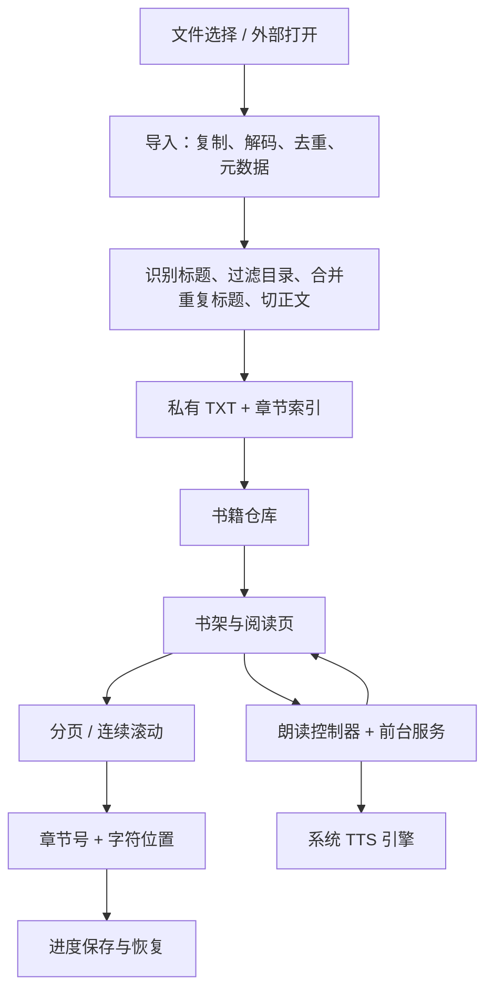

# Story App 项目背景、功能与实现概览

更新时间：2026-09-14。本页描述从开发基线 `8da8362` 推进后的第一阶段成果，代码提交为 `c639941`（存储与导入）和 `e9b9498`（阅读定位与交互）。用户已授权实施 [第一阶段纯阅读稳定性计划](superpowers/plans/2026-09-11-reader-stability-phase-one.md)，**第一阶段本轮覆盖范围已完成实现与验证**，包含启动、存储、阅读定位、Pager与实际测量暴露的过时分页阻塞问题。具体构建、设备、性能边界和执行记录维护在计划中。

## 需求与项目定位

这是以本地 TXT 为核心的 Android 小说阅读器。最初目标是：从文件管理器或其他应用导入小说，自动建立目录，顺畅地翻页或滚动，退出后回到原来的文字位置。后来增加了后台听书、朗读跟随和定时停止。

用户本轮补充的实际语音情况是：**小米中国版设备默认可以朗读，但目前只能用小爱女声，希望有真正的男声音色。** 不应再将这件事描述成“小米无法发声”，也不能用修复初始化或调整音高替代音色需求。

最初明确暂不做在线书源接入、账号、同步、付费、社区及 EPUB/PDF。用户进一步明确：搜索、删除等能力现在也不做，不能因为现状表列出缺口就扩展下一阶段范围。

### 用户已确认的两阶段方向

1. **先把纯看书做稳。** 重点是翻页/滚动时文字跳动或闪烁、标题和章节切分、显示控件、卡顿及其他实际阅读问题。需要代理主动检查完整使用过程，不能依赖用户遇到一个再报告修一个，也要减少修复引起的反复返工。
2. **再解决听小说。** 包括真正可用的男声音色与可靠的听书体验。应复用第一阶段形成的文本、定位、翻页/滚动和显示能力，避免给听书重新写一套页面操作。

用户愿意补充小说样本，但需要代理先说明缺什么、怎么用，并高效利用。第一阶段已授权实施；第二阶段保持后续范围。

## 已有功能与交互

以下按当前代码梳理，不代表已经在真机逐项验收。

| 用户动作 | 当前行为 | 完成程度或需要留意的地方 |
| --- | --- | --- |
| 启动应用 | 共享一次后台初始化，恢复书籍索引、目录、设置和进度；有有效最近阅读书籍时打开，否则进入书架 | 显示载入/重试状态；单本坏书隔离并提示；纯阅读不等待音色预载 |
| 从书架导入 | 系统文件选择 → 共同 URI 读取与校验 → 后台解码、元数据、分章、保存 → 自动开书 | 支持哈希去重、导入中提示和失败反馈；失败导入清理未提交数据 |
| 从其他应用打开/分享 | 接收 VIEW/SEND 文本 URI，与本地选择共用读取、校验、导入和错误反馈 | 正常导入及异常入口已有设备回归，完整运行记录见计划 |
| 管理书架 | 显示书名、作者、章节数、字数，按最近阅读排序，点击开书 | 未见删除、书架搜索、分组入口 |
| 分页阅读 | 默认模式；左右区域点击翻页，中间区域显示/隐藏工具栏；横向滑动使用同一个 Pager | 窗口包含上一章末页、当前章各页、下一章首页；旧叠页动画已移除 |
| 跨章 | 向前进入下一章首屏，向后进入上一章末屏；点击和滑动共用有限章节窗口 | 连续导航、加载中导航/目录覆盖与重排目标保留回归通过，具体证据见计划 |
| 滚动阅读 | 当前书章节进入同一个 LazyColumn，自然跨章；按真实文字行和原文偏移定位 | 不显示“上一章/下一章”操作行；确切行恢复、字号与旋转布局回归已通过 |
| 阅读控制 | 沉浸态保留轻量返回与章名；打开控制后显示完整顶栏和底栏 | 普通工具栏空闲约 3 秒隐藏，设置和目录有独立展开状态 |
| 目录 | 平面章节列表、当前章高亮、打开时靠近当前章；选择替换待执行导航并收起目录 | 无卷—章树形目录、手动改章或重新分章入口 |
| 阅读设置 | 分页/滚动、字号、行距、段距、主题、日夜各自亮度；影响排版的变化保留文字目标后重排 | 主题/亮度只更新显示；设置后台串行保存、合并待写值并原子替换；亮度仍为遮罩压暗，边距仍是代码常量 |
| 保存与恢复 | 只保存已确认的“章节 + 字符位置”；位置和最近阅读书籍一次串行提交 | 失败/取消不以中间页覆盖有效位置；Activity、布局和宿主进程重启的证据分别记录 |
| 开始听书 | 从当前可见阅读位置开始；界面显示状态并跟随、高亮 | 依赖当前系统 TTS 引擎 |
| 听书时翻页/滚动 | 不改变朗读队列；暂时停止跟随约 10 秒后追上 | 与明确的目录跳章不同，后者停止听书 |
| 听书时长按正文 | 从按下处之后的可读位置重新开始，保留定时余额 | 与点击/滑动手势共存，需动态检查冲突 |
| 后台听书 | 前台服务、通知暂停/继续/停止、音频焦点、15/30/60/90/120 分钟定时 | 进程死亡后恢复旧播放队列本来就不在首版范围 |
| 朗读设置 | 与阅读设置合在同一面板的另一页，可选系统音色、语速、音高、定时 | 没有额外男声音源、试听入口或应用内引擎切换 |
| 返回 | 系统返回先关闭目录/设置，否则保存后回书架；顶栏返回直接保存后回书架 | 两个退出入口共用保存路径，后台停止也保存确认位置 |
| 在线书源 | 可从书架进入“暂未开放”说明页 | 占位功能，不是已经接好的书源系统 |

正文搜索、书签、批注、文本选择复制目前也没有形成用户可用入口。此表用于了解现状，未列入当前两阶段实施范围的功能不自动进入待办。

## 代码怎样组织

目前只有一个 Gradle `app` 模块，使用 Kotlin、Compose、Coroutines/Flow，按包分层。早期文档里的 Room、Navigation Compose 是拟议方案；实际使用 Properties/TSV 文件和三个页面状态，并非这些组件已经接入。

主要入口：

- [StoryApplication.kt](/Users/longshengxi/proj/story_app/app/src/main/java/com/longerlsx/storyapp/StoryApplication.kt)：共享后台初始化、进度写入协调、朗读控制器与按需音色预载。
- [StoryApp.kt](/Users/longshengxi/proj/story_app/app/src/main/java/com/longerlsx/storyapp/app/StoryApp.kt)：三个页面、初始化状态、共同导入入口及错误反馈、跨书时停止听书。
- [ImportCoordinator.kt](/Users/longshengxi/proj/story_app/app/src/main/java/com/longerlsx/storyapp/data/book/ImportCoordinator.kt)：共同导入流程。
- [ChapterParser.kt](/Users/longshengxi/proj/story_app/app/src/main/java/com/longerlsx/storyapp/data/book/ChapterParser.kt)：章节解析流水线。
- [InMemoryBookRepository.kt](/Users/longshengxi/proj/story_app/app/src/main/java/com/longerlsx/storyapp/data/book/InMemoryBookRepository.kt)：书籍索引、进度及正文访问；正文按书懒加载，同书并发合并，最多缓存两本。
- [ImportedBookStorage.kt](/Users/longshengxi/proj/story_app/app/src/main/java/com/longerlsx/storyapp/data/book/ImportedBookStorage.kt)、[AnchorStore.kt](/Users/longshengxi/proj/story_app/app/src/main/java/com/longerlsx/storyapp/data/book/AnchorStore.kt)：文件、目录和阅读位置持久化。
- [ReaderScreen.kt](/Users/longshengxi/proj/story_app/app/src/main/java/com/longerlsx/storyapp/feature/reader/ReaderScreen.kt)：阅读界面、滚动行测量、设置、返回、失败重试及已有朗读接线。
- [ReaderPositionState.kt](/Users/longshengxi/proj/story_app/app/src/main/java/com/longerlsx/storyapp/feature/reader/ReaderPositionState.kt)：确认位置、带编号的待执行请求和按顺序累计的翻页输入。
- [StablePageReaderContent.kt](/Users/longshengxi/proj/story_app/app/src/main/java/com/longerlsx/storyapp/feature/reader/StablePageReaderContent.kt)：后台分页、有限章节窗口、点击/滑动和真实布局确认；短按处理也供滚动模式复用。
- [ReaderSettingsStore.kt](/Users/longshengxi/proj/story_app/app/src/main/java/com/longerlsx/storyapp/data/reader/ReaderSettingsStore.kt)：设置校验、内存快照和后台原子保存。
- [ReaderTtsService.kt](/Users/longshengxi/proj/story_app/app/src/main/java/com/longerlsx/storyapp/feature/reader/tts/ReaderTtsService.kt)：队列执行、通知、定时、音频焦点；[AndroidReaderTtsEngine.kt](/Users/longshengxi/proj/story_app/app/src/main/java/com/longerlsx/storyapp/feature/reader/tts/AndroidReaderTtsEngine.kt) 对接 Android 引擎。

值得保留的基础是：两种阅读模式共用“章节 + 字符位置”，不把易变的页码当真实进度；原始 TXT 留在应用私有目录；朗读控制器不依附单个页面；章节切片保存准确的正文范围。

## 翻页、标题与章节切分的理解

**分页复杂度有一部分来自实际排版。** 程序先用字体、行距、段距和可用高度测量文本，再按行分页，并复查单页是否装得下。相邻章节预先分页，以便向后翻时知道上一章最后一页。这个过程比“固定字数一页”复杂，但有必要。

当前分页由 `StablePageReaderContent` 管理同一个 HorizontalPager。目标章节先计算，邻章随后准备，结果按章节和排版参数复用；内部重新居中保持同页身份，不另记一次用户翻页。测量在后台串行进行，计算器持有自己的 TextMeasurer；段落测量前后和分页边界检查当前请求是否已取消，过时计算尽快结束且不发布部分结果。单次底层文字测量不能在调用中间抢断。主题色不再进入分页标识。准备时保留上一份有效页面及其排版参数，真实页面布局确认后才提交进度。

两种阅读模式共用 `ReaderPositionState`。连续翻页按输入顺序从待到达位置推进，目录选择替换旧目标，重排保留目标文字；滚动恢复使用段落实际 TextLayoutResult 的行坐标，不再用整章高度比例。正文短按只有一处派发，长按、拖动、取消和多指不作为松手点击。手势松开不直接确认页面，要等原生惯性滑动真正完成后交给共同定位入口；该入口检查实际页面布局并负责超时、重试、返回及有效进度保存。精确行恢复和读取失败后的返回/重试已有设备回归。

**章节解析已经不是一个大正则。** 它先抽样选主标题格式，随后扫描整本，补充识别序章/番外/卷名，过滤书前目录、合并双标题，最后才按边界切正文。前言会保留；没有识别到标题时有整段正文或长文兜底切分。

例如 `第 1 章`、`第一章` 连续出现且中间没有正文，应合并成一个目录项，正文从后面的故事开始；`第141章 番外一` 后再重复 `番外一` 也有专门处理。标题识别、标题显示与正文起点是不同问题，直接简化成“匹配一行就切章”会重新引入丢内容、重复标题和恢复偏移。

值得回看的地方是：主格式只从开头最多 2,000 行/100,000 字符选取，混合格式的兼容不是完全通用；副标题标点、对话式正文、回合数等规则已积累不少例外。书前目录的判断同时参与规则评分和后续过滤，两者目的不同，不能因为看似重复就删除，但应统一概念并用真实小说整体比较结果。

## 当前数据与模块边界

启动只恢复索引、目录、源文件登记、设置和进度，不读取整架正文。正文首次访问按书读取，最多缓存两本，同书并发访问共用一次加载，文件 IO 不占用仓库全局锁。分页只准备当前章节窗口；滚动模式仍为当前书准备章节正文。听书的队列准备方式本轮没有重构。

导入与重载继续使用原 TXT 和既有章节偏移，不自动重切旧书。目录读取兼容标题内的 TAB，并检查章节数量、序号和范围；坏书单独报告。hydrate 只恢复内存，不重写磁盘。目录、设置和进度通过临时文件原子替换，新导入最后提交元数据，失败不会留下可打开的半本书。

`ReaderScreen` 仍负责阅读界面和朗读连接，但位置意图与分页窗口已有明确责任边界。此次改动复用原解析、按行分页、页底复查和文字渲染，没有引入数据库、全书预分页或通用缓存框架。历史方案和修复经过按 [文档入口](README.md) 路由查询，不作为当前实现清单。

## 男声需求与浏览器的对比

朗读和中文男声是成熟需求。当前应用的问题在于提供声音的来源有限：只读取默认系统引擎的音色目录，没有自带其他音色。应先查看小米引擎实际暴露的原始列表，排除已有男声被筛掉；若确实只有女声，再修改过滤规则也不会产生男声。`pitch` 改变音高，不会更换发音人；Android Voice 也没有统一的性别字段。[Android Voice 文档](https://developer.android.com/reference/android/speech/tts/Voice)、[TextToSpeech 文档](https://developer.android.com/reference/android/speech/tts/TextToSpeech)。

浏览器可以提供自己的在线或离线朗读能力。以 Edge 为例，官方明确支持在线和离线朗读，离线音色较少。因此浏览器能选多种声音，不意味着这些声音会注册成其他 Android 应用可用的系统 TTS 音色。[Edge 官方说明](https://explore.microsoft.com/en-us/edge/features/read-aloud)。

| 方向 | 用户实际得到什么 | 主要代价 |
| --- | --- | --- |
| 选择其他已安装系统引擎 | 能用该引擎提供的男声 | 需要安装/配置，仍依赖外部引擎 |
| 应用接入正规在线语音 | 可以明确提供选定的中文男声，跨设备较一致 | 联网、鉴权、服务费用，以及音频播放/位置同步 |
| 应用集成离线语音包或模型 | 可在本机合成，声音能力由应用提供 | 包体、性能、授权与语音包管理 |

国内已有现成供应方。例如阿里云公开列出中文男声及面向文学阅读的离线声音，这能证明需求可落地，但本轮未试听，也未做成本和供应商选型。[在线语音文档](https://help.aliyun.com/zh/isi/developer-reference/overview-of-speech-synthesis/)、[离线语音文档](https://help.aliyun.com/zh/isi/developer-reference/sdk-reference-11)。

我的倾向是保留系统朗读作为可用基础，再按“是否希望装完应用就能直接选男声”决定是否接入一个受控音源。不要继续把男声需求当作小米适配 bug，也不需要自研语音模型。

## 当前验证结果与证据边界

构建和模拟器入口已经恢复，TLS 下载故障不再是当前阻断。当前取得的直接证据如下；构建批次及运行细节见 [第一阶段计划执行记录](superpowers/plans/2026-09-11-reader-stability-phase-one.md)。

- 数据定向单元测试通过，覆盖旧目录/进度兼容、只读恢复、坏书隔离、导入和设置持久化等改动。
- 既有 9 本 TXT 已通过生产解码、导入、保存、新仓库重载的全量回归，对比标题、顺序、偏移、逐章正文和中间进度。
- 真实 Compose 测量与生产页面渲染的 3 项完整性回归全部通过，覆盖混合段落/空行/大字号、超长单段及大量不同长度段落，检查顺序覆盖和行边界。
- 导入及 5 项连续导航合计 10 项设备回归通过。导航覆盖短章双向滑动、连续前进/后退、书首边界顺序、目录后的翻页目标和短拖动回弹。

重排与待加载连续操作、读取失败后保留进度/返回/重试、长章连续翻页、精确滚动恢复及字号/旋转回归已通过；另外9项控件/设置/共享朗读接线回归通过。release 正常运行进程被宿主终止、确认进程消失后重新启动，仍回到同一文字行，磁盘章节/字符位置一致；这项证据独立于 Activity 重建。动态检查暴露的滑动正文/标题不同步已修正，强化后的设备测试逐步断言正文、标题及落盘进度；正常 release 的前/前/后动态交接也已核对正文、标题与章节数一致。全部相关设备用例合计31项，按受影响范围分批运行；不是全项目所有测试的宣称。

实际字号采样进一步发现旧计算会拖住最新目标，已在段落/分页边界加入取消检查；7项分页单测及受影响的5项真实排版/重排回归通过，同一字号窗口的最终结果见计划。单次底层测量不能中途抢断，计算结束也不等同于画面稳定时刻。

尚无小米真机交互、试听或男声音色改造结果，也没有可信的性能分位数。本轮模拟器曾受系统 ANR、渲染配置和存储空间影响，异常数据不能直接归因为分页或推广到小米；性能输入、构建及环境限制统一见 [计划中的性能口径与冻结记录](superpowers/plans/2026-09-11-reader-stability-phase-one.md#4-分页性能口径与冻结)。

目录 TAB 标题问题的研究和修复记录见 [BUG-2026-045](knowledge/bugs/BUG-2026-045-tab-heading-lost-on-catalog-restore.json)；朗读文本与原文偏移问题见 [BUG-2026-046](knowledge/bugs/BUG-2026-046-tts-spoken-source-offset-mismatch.json)。其他历史问题从 [bug 索引](knowledge/bugs/INDEX.md) 查询。听书长句分段、续读位置和音色失败反馈等仍属于后续听书核查范围；已有替代引擎测试不证明设备声音或音色质量。

## 两阶段推进范围

**第一阶段本轮实施已收口。** 覆盖数据兼容、导入保存、连续阅读、重排、退出恢复、显示控件及已确认的分页取消问题；交付 [debug APK](/Users/longshengxi/proj/story_app/app/build/outputs/apk/debug/app-debug.apk) 和 [本地签名 release APK](/Users/longshengxi/proj/story_app/app/build/outputs/apk/release/app-release.apk)。完整证据边界和构建标识见第一阶段计划，不以本次模拟器覆盖代替所有真实设备和所有小说来源的保证。

**2026-09-14 用户确认：第二阶段之前先优化超长章节排版。** 先提交并推送现有成果作为基线。过时计算阻塞已修复，但有效目标的剩余耗时尚未拆清；整章准备、候选页复测及运行环境的成本需要区分，不能归结为框架硬限制或声称优化空间已耗尽。该优化保持正文完整、位置一致及页底不裁行，具体实施和验收口径在后续性能任务中制定。

**已有样本已经用于回归。** `/Users/longshengxi/Downloads/小说测试集` 中的 9 本 TXT，单本约 0.80–3.97 MiB，现已完成上述生产导入重载检查；它们都是历史样本，不能称为未见输入，也不能以读写一致替代所有分章语义验证。只有遇到明确的来源、编码、标题格式或规模缺口时，再集中说明需要什么新样本以及用途。

**第二阶段复用阅读能力，播放保持自身职责。** 阅读器负责显示和定位，听书负责合成/播放及报告读到哪里；当前页面起读、长按重读和朗读跟随继续复用共同文字位置。播放队列、通知、音频焦点、定时和音源选择仍属于听书本身。第一阶段仅处理影响纯阅读的耦合，没有提前接入男声音源或重构听书服务。
