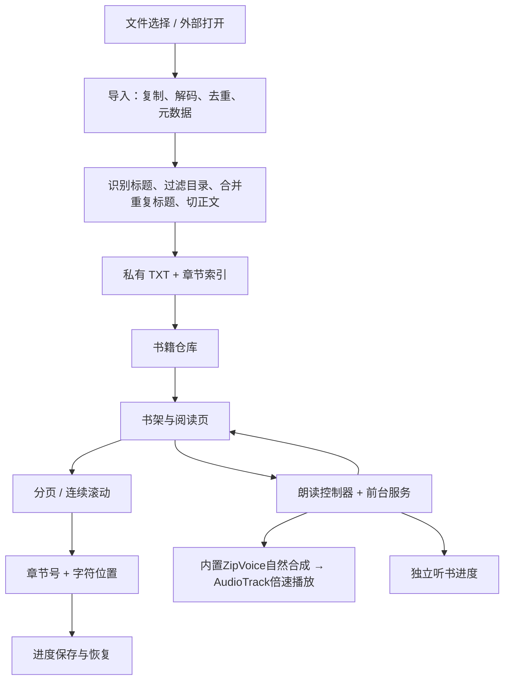

# 大脸猫阅读（Story App）项目背景、功能与实现概览

更新时间：2026-09-23。**ZipVoice与听书交互目标已完成本轮模拟器验收：** 只保留雷军合成音色，实现页顶直接起读、独立听书面板、图标暂停／停止与紧凑播放条。[新版debug APK](/Users/longshengxi/proj/story_app/app/build/outputs/zipvoice-upgrade/daliamao-reader-debug-20260922.apk)约215MiB、仅ARM64，完全离线，不打包旧音色。真实小说1×／2×连续播放、后台与焦点恢复、数字读法、旧版覆盖升级及进程终止恢复均有直接证据。APK完整身份、实现关系和验证范围由[本轮实施计划](superpowers/plans/2026-09-22-zipvoice-listening-upgrade.md)维护；仅模拟器验收，不安排或等待真机，不声称新音源的小米性能通过。

**本轮已实现的交互：** 每次新开听书从操作时当前页面最上一行正文直接开始，不再选择起点；暂停／继续保留原会话。独立听书面板固定显示图标播放／暂停、停止和收起操作，下方设置按定时→语速→音色→更多选项排列；普通阅读设置不再包含朗读页签。正常操作不追加成功提示，面板覆盖正文而不改变分页尺寸。[已确认交互讨论稿](superpowers/specs/2026-09-22-listening-controls-and-voice.md)保存设计来源，当前实现及验收边界以下文为准。

**9月20日视觉与听书操作（历史交付）：** 四页日夜改版、2×语速、直接停止、名称／猫脸图标已实现，当时Kokoro音源的连续跨章真实音频、暂停／停止／续听及旧版覆盖升级检查通过。[当时的debug APK](/Users/longshengxi/proj/story_app/app/build/outputs/visual-upgrade/daliamao-reader-debug-20260920.apk)与[四页真实前后对比](superpowers/specs/assets/2026-09-20-visual-direction/implemented-compare.html)保留历史身份。当时验收在模拟器完成；随后按用户要求覆盖安装并正常打开在小米15 Ultra上，手机安装包SHA与交付包一致，未清除应用数据。该次安装不增加真机2×或长听验收结论，更不证明本轮ZipVoice通过。实现、证据、APK身份和限制由[9月20日实施计划](superpowers/plans/2026-09-20-visual-listening-upgrade.md)维护。

**历史已交付基线：** 9月20日免费离线听书目标已按用户最终确认范围完成，v3已安装并打开在15 Ultra上，书籍与进度保留。四种内置音色、约124秒正文连续输出、通知实际播放／暂停／回正文、进程终止后的显式续听和真实系统音频焦点恢复均有直接证据。两次临时打断保留原音频，归还控制权后约0.12秒播放帧继续推进；主动暂停及永久失焦不会擅自续播。用户明确将真机30分钟不充电熄屏移为后续体验项，不作为当时完成卡点；模拟器该项已通过。v3的主观听感、原消息应用、物理耳机／来电及17 Pro仍未逐项实测，不宣称所有设备和场景已验收。各项证据所属版本、条件及限制见[听书实施计划](superpowers/plans/2026-09-20-offline-listening.md)。9月14日纯阅读性能与交互缺口优化也已完成实现及验证，未受影响证据继续继承；对应记录在[9月14日计划](superpowers/plans/2026-09-14-pagination-measurement-reuse.md)。上述代码已按用户授权提交并推送至`origin/feat-android-reader-foundation`：`a1a2538`为分页测量优化，`d8848fe`为阅读交互及离线听书；这不是9月22日本轮ZipVoice改动的提交或交付声明。

第一阶段历史成果为 `c639941`（存储与导入）、`e9b9498`（阅读定位与交互）；[9月11日计划](superpowers/plans/2026-09-11-reader-stability-phase-one.md) 保存当时的构建与验证，未受本轮影响的证据继续继承。

**旧计划管理状态：** [4月23日阅读锚点与排版计划](superpowers/plans/2026-04-23-reader-anchor-and-page-layout-bugs.md)、[5月21日章末翻页与跨章过渡计划](superpowers/plans/2026-05-21-page-reader-boundary-and-transition.md)均已关闭、归档，由后续阅读重构和听书实现接替；原勾选记录仅保留历史身份，不形成当前待办。相关问题若再次出现，按新版实际路径和新证据跟踪，不恢复执行旧方案。

**视觉方向探索（历史，当时未实施）：** 用户要求使用UI UX Pro Max与mobile-android-design查看美化方向，两项技能已安装；[9月20日视觉讨论稿](superpowers/specs/2026-09-20-visual-direction.md)提供书架、阅读控制、听书及阅读设置四组真实截图／概念图对比。讨论稿当时仅用于选择方向，未改变App行为；用户随后授权实施，由[9月20日实施计划](superpowers/plans/2026-09-20-visual-listening-upgrade.md)承接，不能继续把这四页改版整体描述为“未实施”。

## 需求与项目定位

这是以本地 TXT 为核心的 Android 小说阅读器。最初目标是：从文件管理器或其他应用导入小说，自动建立目录，顺畅地翻页或滚动，退出后回到原来的文字位置。后来增加了后台听书、朗读跟随和定时停止。

用户在上一轮听书任务补充的实际语音情况是：**小米中国版设备默认可以朗读，但当时只能用小爱女声，希望有真正的男声音色。** 不应再将这件事描述成“小米无法发声”，也不能用修复初始化或调整音高替代音色需求。用户另报告设30–60分钟定时、熄屏后几分钟会中断且难以继续，属于半实验版本；上一轮已处理后台与恢复，模拟器完整30分钟熄屏定时已通过，真机长测按用户最终要求不阻断当时交付，不能反称旧路径稳定或小米长测已通过。用户允许根据实际设计重做听书交互和内部结构。设备为小米15 Ultra及17 Pro；15 Ultra已核对型号25019PNF3C、Android 16、HyperOS `OS3.0.306.0.WOACNXM`，17 Pro尚未核对或测试。

最初明确暂不做在线书源接入、账号、同步、付费、社区及 EPUB/PDF。用户进一步明确：搜索、删除等能力现在也不做，不能因为现状表列出缺口就扩展下一阶段范围。

### 用户已确认的两阶段方向

1. **先把纯看书做稳。** 重点是翻页/滚动时文字跳动或闪烁、标题和章节切分、显示控件、卡顿及其他实际阅读问题。需要代理主动检查完整使用过程，不能依赖用户遇到一个再报告修一个，也要减少修复引起的反复返工。
2. **再解决听小说。** 包括真正可用的男声音色与可靠的听书体验。应复用第一阶段形成的文本、定位、翻页/滚动和显示能力，避免给听书重新写一套页面操作。

用户愿意补充小说样本，但需要代理先说明缺什么、怎么用，并高效利用。上述两阶段已有交付成果，本轮在此基础上替换为单一雷军音源并重做听书入口与面板，声音来源约束继续适用，见下文。

## 已有功能与交互

以下按当前代码梳理，不代表已经在真机逐项验收。

| 用户动作 | 当前行为 | 完成程度或需要留意的地方 |
| --- | --- | --- |
| 应用名称与图标 | 对外名称为“大脸猫阅读”，启动图标取自原宠物猫脸；书架、应用标签及通知渠道文案同步 | 内部包名与存储格式沿用，旧渠道保留用户偏好；本轮已通过旧APK正常导入、设置、播放后覆盖ZipVoice候选的检查，书籍、设置和位置保留；旧版证据另标历史 |
| 启动应用 | 共享一次后台初始化，恢复书籍索引、目录、设置和进度；有有效最近阅读书籍时打开，否则进入书架 | 显示载入/重试状态；单本坏书隔离并提示；纯阅读不等待音色预载 |
| 从书架导入 | 系统文件选择 → 共同 URI 读取与校验 → 后台解码、元数据、分章、保存 → 自动开书 | 支持哈希去重、导入中提示和失败反馈；失败导入清理未提交数据 |
| 从其他应用打开/分享 | 接收 VIEW/SEND 文本 URI，与本地选择共用读取、校验、导入和错误反馈 | 正常导入及异常入口已有设备回归，完整运行记录见计划 |
| 管理书架 | 书名优先，配本地文字封面及作者、章节数、字数，按最近阅读排序；导入入口突出，点击开书 | 采用暖纸、墨字、松绿的界面层级；未增加在线封面、删除、书架搜索或分组 |
| 分页阅读 | 默认模式；左右区域点击翻页，中间区域显示/隐藏工具栏；横向滑动使用同一个 Pager | 窗口包含上一章末页、当前章各页、下一章首页；旧叠页动画已移除 |
| 跨章 | 向前进入下一章首屏，向后进入上一章末屏；点击和滑动共用有限章节窗口 | 连续导航、加载中导航/目录覆盖与重排目标保留回归通过，具体证据见计划 |
| 滚动阅读 | 当前书章节进入同一个 LazyColumn，自然跨章；按真实文字行和原文偏移定位 | 不显示“上一章/下一章”操作行；确切行恢复、字号与旋转布局回归，以及9月14日真实长章进入/反向/退出恢复路径已通过 |
| 阅读控制 | 沉浸态保留轻量返回与章名；工具栏采用矢量图标与中文标签，设置／目录采用单层展开面板，提供关闭入口，日夜沿用同一信息层级 | 普通工具栏空闲约 3 秒隐藏；面板覆盖正文，不参与分页高度计算；控件强调色独立于正文主题与排版 |
| 目录 | 平面章节列表、当前章高亮、打开时靠近当前章；选择替换待执行导航并收起目录 | 无卷—章树形目录、手动改章或重新分章入口 |
| 阅读设置 | 只包含阅读选项，不再设朗读页签；保留分页／滚动切换、亮度（日夜分别保存）、字号、行距、段距和主题，主题有标签与勾选，窄屏大字时参数上下排列 | 选择立即保存，显示可暂留已确认排版；主题/亮度只更新显示，设置后台串行保存、合并待写值并原子替换；PAGE→SCROLL 在目标文字行确认后公开新画面 |
| 保存与恢复 | 只保存已确认的“章节 + 字符位置”；位置和最近阅读书籍一次串行提交 | 失败/取消不以中间页覆盖有效位置；Activity、布局和宿主进程重启的证据分别记录 |
| 开始听书 | 没有当前会话时，点击听书入口直接从当前显示页最上一行正文开始并展开面板；不再显示“从当前文字开始／继续上次听书”等起点选择 | PAGE取已显示页的首个正文偏移，SCROLL取实际最上方可见正文行；点击时先固定起点，再展开面板或等待通知权限。正文尚未显示完成时提示稍后重试；旧恢复锚点不作为新开起点 |
| 听书入口与面板 | 听书面板独立于阅读设置；播放、暂停或准备中再次点击入口只展开面板，长按听书入口只打开设置、不启动。收起后紧凑条保留状态、语速、定时及图标暂停／继续、停止 | 面板顶部播放控件固定，设置正文可滚动；点击紧凑条可展开。普通操作不追加成功浮条，不改变正文排版或穿透触发正文 |
| 暂停与停止听书 | 暂停保留会话和剩余定时，继续沿用原会话；停止取消生成与待播队列、清空本次计时、释放播放资源并收起通知，设置和已保存听书位置保留 | 停止后旧任务和焦点回调不能自行续播；新开须明确操作，从届时页顶正文开始并重置所选定时。焦点恢复、自动跨章与暂停继续不套用新开的页顶规则 |
| 听书时翻页/滚动 | 普通浏览暂时停止跟随约10秒后追上；明确目录/章节按钮及手动分页跨章停止听书 | 自动跟读、通知定位和会话恢复跨章不会误当手动翻章而停止 |
| 听书时长按正文 | 从按下处之后的可读位置重新开始，保留定时余额 | 与点击/滑动手势共存，需动态检查冲突 |
| 后台听书 | 沿用前台媒体服务、通知/锁屏控制、音频焦点、耳机断开暂停和定时；自定义“停止”与标准停止、通知入口共用结束路径 | ZipVoice真实引擎4条后台回归已通过，覆盖熄屏、通知操作、临时失焦恢复及主动暂停／永久失焦不自动续播；另有真实进程终止后恢复证据。结论限指定模拟器，不安排或等待真机 |
| 听书设置 | 顺序为定时→语速→音色→更多选项；不定时、15/30/60分钟直接可选，90/120分钟在“更多”中；音色仅显示“雷军 · 合成音色”，音调置于更多选项 | 已删除多音色选择及试听入口；设置自动保存，语速和音调从下一语音单元生效，已选值再次点击不追加更新 |
| 调整语速 | 可选0.85×、1×、1.3×、1.45×、2×，标签对应实际数值；旧1.15设置读取为1× | ZipVoice固定按自然1×完整合成，AudioTrack应用实际播放速度和独立音调；当前单元保留开始时的参数，下一单元用最新值，自然语音缓存不因换播放速度失效。四线程下的2×连续供给及预生成音频换速实播已通过，范围限本轮模拟器与已测输入 |
| 返回 | 系统返回先关闭目录、阅读设置或听书面板，否则保存后回书架；顶栏返回直接保存后回书架 | 两个退出入口共用保存路径，后台停止也保存确认位置 |
| 在线书源 | 书架已收起未开放的在线书源入口；旧说明页代码仍保留 | 未接入书源系统，不扩展本轮范围 |

正文搜索、书签、批注、文本选择复制目前也没有形成用户可用入口。此表用于了解现状，未列入当前两阶段实施范围的功能不自动进入待办。

## 代码怎样组织

目前只有一个 Gradle `app` 模块，使用 Kotlin、Compose、Coroutines/Flow，按包分层。早期文档里的 Room、Navigation Compose 是拟议方案；实际使用 Properties/TSV 文件和三个页面状态，并非这些组件已经接入。

主要入口：

- [StoryApplication.kt](/Users/longshengxi/proj/story_app/app/src/main/java/com/longerlsx/storyapp/StoryApplication.kt)：共享后台初始化、进度写入协调、朗读控制器与按需音色预载。
- [StoryApp.kt](/Users/longshengxi/proj/story_app/app/src/main/java/com/longerlsx/storyapp/app/StoryApp.kt)：三个页面、初始化状态、共同导入入口及错误反馈、跨书时停止听书。
- [ImportCoordinator.kt](/Users/longshengxi/proj/story_app/app/src/main/java/com/longerlsx/storyapp/data/book/ImportCoordinator.kt)：共同导入流程。
- [ChapterParser.kt](/Users/longshengxi/proj/story_app/app/src/main/java/com/longerlsx/storyapp/data/book/ChapterParser.kt)：章节解析流水线。
- [InMemoryBookRepository.kt](/Users/longshengxi/proj/story_app/app/src/main/java/com/longerlsx/storyapp/data/book/InMemoryBookRepository.kt)：书籍索引、进度及正文访问；正文按书懒加载，同书并发合并，最多缓存两本。
- [ImportedBookStorage.kt](/Users/longshengxi/proj/story_app/app/src/main/java/com/longerlsx/storyapp/data/book/ImportedBookStorage.kt)、[AnchorStore.kt](/Users/longshengxi/proj/story_app/app/src/main/java/com/longerlsx/storyapp/data/book/AnchorStore.kt)：文件、目录和阅读位置持久化。
- [ReaderScreen.kt](/Users/longshengxi/proj/story_app/app/src/main/java/com/longerlsx/storyapp/feature/reader/ReaderScreen.kt)：阅读界面、滚动行测量、设置、返回、失败重试及已有朗读接线。
- [ReaderPositionState.kt](/Users/longshengxi/proj/story_app/app/src/main/java/com/longerlsx/storyapp/feature/reader/ReaderPositionState.kt)：确认位置、带编号的待执行请求和按顺序累计的翻页输入。
- [StablePageReaderContent.kt](/Users/longshengxi/proj/story_app/app/src/main/java/com/longerlsx/storyapp/feature/reader/StablePageReaderContent.kt)：共享章节计算器、有限窗口、缓存命中与真实布局确认；[ReaderPageGestureInput.kt](/Users/longshengxi/proj/story_app/app/src/main/java/com/longerlsx/storyapp/feature/reader/ReaderPageGestureInput.kt) 观察单次手势并派发翻页意图。
- [ReaderPageTextLayout.kt](/Users/longshengxi/proj/story_app/app/src/main/java/com/longerlsx/storyapp/feature/reader/ReaderPageTextLayout.kt)、[ReaderPagePagination.kt](/Users/longshengxi/proj/story_app/app/src/main/java/com/longerlsx/storyapp/feature/reader/ReaderPagePagination.kt)：真实行测量及段落轻量指标复用；仍对页首尾截断片段测量、按行回退并核对页底。
- [ReaderSettingsStore.kt](/Users/longshengxi/proj/story_app/app/src/main/java/com/longerlsx/storyapp/data/reader/ReaderSettingsStore.kt)：设置校验、内存快照和后台原子保存。
- [ReaderControls.kt](/Users/longshengxi/proj/story_app/app/src/main/java/com/longerlsx/storyapp/feature/reader/ReaderControls.kt)维护覆盖式控制、听书入口与紧凑条；[ReaderSettingsSheet.kt](/Users/longshengxi/proj/story_app/app/src/main/java/com/longerlsx/storyapp/feature/reader/ReaderSettingsSheet.kt)只承载阅读设置，[ReaderTtsSettingsSheet.kt](/Users/longshengxi/proj/story_app/app/src/main/java/com/longerlsx/storyapp/feature/reader/ReaderTtsSettingsSheet.kt)承载独立听书面板；[ReaderTtsSpeechRates.kt](/Users/longshengxi/proj/story_app/app/src/main/java/com/longerlsx/storyapp/core/model/ReaderTtsSpeechRates.kt)统一语速选项、标签及旧值迁移。
- [ReaderTtsService.kt](/Users/longshengxi/proj/story_app/app/src/main/java/com/longerlsx/storyapp/feature/reader/tts/ReaderTtsService.kt)：有限章节队列、媒体会话、定时、音频焦点与恢复；[OfflineReaderTtsEngine.kt](/Users/longshengxi/proj/story_app/app/src/main/java/com/longerlsx/storyapp/feature/reader/tts/OfflineReaderTtsEngine.kt)负责ZipVoice初始化、自然语速合成与AudioTrack倍速播放；[ListeningProgressStore.kt](/Users/longshengxi/proj/story_app/app/src/main/java/com/longerlsx/storyapp/data/reader/ListeningProgressStore.kt)独立保存听书检查点。生产音源已替换为ZipVoice，不打包旧Kokoro作为备用。

值得保留的基础是：两种阅读模式共用“章节 + 字符位置”，不把易变的页码当真实进度；原始 TXT 留在应用私有目录；朗读控制器不依附单个页面；章节切片保存准确的正文范围。

## 翻页、标题与章节切分的理解

**分页复杂度有一部分来自实际排版。** 程序先用字体、行距、段距和可用高度测量文本，再按行分页，并复查单页是否装得下。相邻章节预先分页，以便向后翻时知道上一章最后一页。这个过程比“固定字数一页”复杂，但有必要。

当前分页由 `StablePageReaderContent` 管理同一个 HorizontalPager。目标章节先计算，邻章随后准备，结果按章节和排版参数复用；内部重新居中保持同页身份，不另记一次用户翻页。测量在后台串行进行，计算器持有自己的 TextMeasurer；段落测量前后和分页边界检查当前请求是否已取消，过时计算尽快结束且不发布部分结果。单次底层文字测量不能在调用中间抢断。主题色不再进入分页标识。准备时保留上一份有效页面及其排版参数，真实页面布局确认后才提交进度。

两种阅读模式共用 `ReaderPositionState`。连续翻页按输入顺序从待到达位置推进，目录选择替换旧目标，重排保留目标文字；滚动恢复使用实际文字行坐标。有效滑动释放时接受一次翻页，共同目标同时驱动标准吸附；缺少邻章预览也保留输入，动画完成不追加翻页。确认仍等待目标真实布局及手势/动画结束，旧目录手势不能覆盖新目标。正文短按只有一处派发，长按、拖动、取消和多指不作为松手点击。

设置选择立即独立保存，显示可以暂留旧排版；切模式后旧执行者不能确认或报错覆盖新模式。未解析的PAGE翻页先按输入时布局求文字锚点，再交给目标模式。feed带书籍/模式/章节/重试身份；错误回退以确认文字为准，只有正文、排版和视口一致才复用像素位置，保留原错误及重试目标。该共同入口负责超时、重试、返回及有效进度保存。

正常 release 动态检查曾发现，PAGE→SCROLL 仅等 feed 就绪便显示列表，会在真实行定位前短暂露出旧滚动视口。现在保留确认 PAGE 画面直到目标滚动行确认，不挂载第二个执行中的 Pager。逐帧回归和最终 release 的同章、跨章两条动态复查均已通过，见 [BUG-2026-053](knowledge/bugs/BUG-2026-053-page-to-scroll-shows-stale-viewport.json)。

**章节解析已经不是一个大正则。** 它先抽样选主标题格式，随后扫描整本，补充识别序章/番外/卷名，过滤书前目录、合并双标题，最后才按边界切正文。前言会保留；没有识别到标题时有整段正文或长文兜底切分。

例如 `第 1 章`、`第一章` 连续出现且中间没有正文，应合并成一个目录项，正文从后面的故事开始；`第141章 番外一` 后再重复 `番外一` 也有专门处理。标题识别、标题显示与正文起点是不同问题，直接简化成“匹配一行就切章”会重新引入丢内容、重复标题和恢复偏移。

值得回看的地方是：主格式只从开头最多 2,000 行/100,000 字符选取，混合格式的兼容不是完全通用；副标题标点、对话式正文、回合数等规则已积累不少例外。书前目录的判断同时参与规则评分和后续过滤，两者目的不同，不能因为看似重复就删除，但应统一概念并用真实小说整体比较结果。

## 当前数据与模块边界

启动只恢复索引、目录、源文件登记、设置和进度，不读取整架正文。正文首次访问按书读取，最多缓存两本，同书并发访问共用一次加载，文件 IO 不占用仓库全局锁。分页只准备当前章节窗口；滚动模式仍为当前书准备章节正文。听书只保留当前章和最多下一章的短句队列，当前播放期间串行准备最多后两短句音频，不提前生成全书。

导入与重载继续使用原 TXT 和既有章节偏移，不自动重切旧书。目录读取兼容标题内的 TAB，并检查章节数量、序号和范围；坏书单独报告。hydrate 只恢复内存，不重写磁盘。目录、设置和进度通过临时文件原子替换，新导入最后提交元数据，失败不会留下可打开的半本书。

`ReaderScreen` 仍负责阅读界面和朗读连接，但位置意图与分页窗口已有明确责任边界。此次改动复用原解析、按行分页、页底复查和文字渲染，没有引入数据库、全书预分页或通用缓存框架。历史方案和修复经过按 [文档入口](README.md) 路由查询，不作为当前实现清单。

## 男声需求与浏览器的对比

用户举小米默认浏览器的小说阅读能力，是在说明：连不以小说阅读为主要用途的产品，也能把阅读和朗读做得完善，这应按成熟的常见产品能力理解。这个例子不是要求模仿浏览器的界面或操作方式，也不直接规定采用哪种语音技术。后续目标应面向完整听小说体验，不能把基础能力描述成只适合专业软件的小众定制。

朗读和中文男声是成熟需求。旧版只读取默认系统引擎的音色目录，没有自带音源；过滤规则无法创造引擎本来没有的声音。`pitch`改变音高，不会更换发音人；Android Voice也没有统一的性别字段。上一轮按用户已定的独立免费离线方向引入实际音源，不再以调整系统音色过滤作为男声方案。[Android Voice 文档](https://developer.android.com/reference/android/speech/tts/Voice)、[TextToSpeech 文档](https://developer.android.com/reference/android/speech/tts/TextToSpeech)。

浏览器可以提供自己的在线或离线朗读能力。以 Edge 为例，官方明确支持在线和离线朗读，离线音色较少。因此浏览器能选多种声音，不意味着这些声音会注册成其他 Android 应用可用的系统 TTS 音色。[Edge 官方说明](https://explore.microsoft.com/en-us/edge/features/read-aloud)。

**2026-09-20 用户已确认：免费、离线，能与 Story App 打包在一起最好。** 免费和离线是声音来源的选择约束；一体打包是明确优先项。目标是手机本地为新文本生成中文男声，不依赖云端合成或付费语音授权，也不把另外安装、配置独立语音引擎作为默认体验。APK体积与是否有必要拆分语音资源应由候选数据说明，不能自动把“离线”改成仅缓存已在线生成的语音。

用户进一步明确这是个人自用App，功能和使用体验优先，普通实现取舍由代理自主决定，不把未来公开分发的许可流程或无关要求设成当前卡点。来源和版本保留必要记录。

当前工作区沿用sherpa-onnx 1.13.8，音源替换为 **ZipVoice-Distill INT8／4步＋官方 `leijun-1` 参考声音**；唯一音色标识为 `zipvoice:leijun`，界面显示“雷军 · 合成音色”。这是参考声音条件下为新正文生成的合成音频，不是原讲话录音。APK内置一套模型及一个参考声音，不依赖系统TTS、联网下载或额外训练；旧 `kokoro:*` 等音色值读取时归一为新音色，书籍、进度和其他设置不因换音源清除。资源版本与准备入口由[离线声音依赖](knowledge/offline-voice-dependencies.md#当前接入选择)维护。当前仅打包ARM64，候选约215MiB；旧四音色Kokoro与约443MiB包体属于9月20日版本，不是当前备用方案。

ZipVoice原生倍速曾在模拟器将目标声音截短，现已改为先完整合成自然1×音频，再由AudioTrack施加用户语速与独立音调；下一语音单元使用最新设置，同一自然音频无需因换速重新生成。截短原因与处理详见[依赖说明](knowledge/offline-voice-dependencies.md)。播放完成才推进独立听书位置；停止、旧任务失效与焦点恢复仍走已有服务边界。生成改为四线程后，已测2×跨章序列及真实小说连续播放通过，预生成音频也已证实按新速度播放而不重算；具体环境和窗口见下文，不推广为手机播放性能。

验收边界继续适用：播放状态和回调不能证明实际出声，合成音频不能单独证明扬声器播放；音色和连续播放需要实际声音证据。历史Kokoro v3曾在15 Ultra媒体音量0时取得非零内部播放音轨，手机和电脑均未外放；该证据不代替ZipVoice、扬声器、耳机或实际听感验收。9月22日本轮只验收模拟器，不安排或等待小米测试，也不据模拟器结果声称真机性能通过。

用户要求目标执行由代理自行安排推进节奏，关键过程落文档并按需要配图，留下维护所需的决定、实现关系和证据，避免堆积日志。面向用户说明怎么做、做到什么程度、哪些尚未验证或仍需研究，不要求用户先理解Android技术；稳定规则见[协作约定的文档维护](knowledge/agent-operating-agreements.md#文档维护)。[听书实施计划](superpowers/plans/2026-09-20-offline-listening.md)已收口：本地与真机已覆盖路径的实质问题关闭，用户最终明确30分钟真机熄屏不作为目标卡点。未覆盖的设备和实际使用变体保留证据边界，不将它们写成已通过，也不另增交付门槛。

## 当前验证结果与证据边界

**9月22日ZipVoice与听书交互：** 单一雷军音源、旧音色读取兼容、页顶起读、独立面板及播放倍速已完成。迁移、面板状态、音频准备单测及首批完整界面回归通过；后续跟读与后台接线组19项通过，覆盖PAGE／SCROLL页顶、暂停保留会话和计时、停止重开、面板／紧凑条／长按入口、失败偏移重试、跟读及手动跨章停止。批次存在交集，不累加为独立总数。[本轮计划](superpowers/plans/2026-09-22-zipvoice-listening-upgrade.md#执行记录)保存对应构建和各项直接证据。

本轮环境为`StoryReader_API34`模拟器：Android14/API34 ARM64、4核、4GiB RAM、SwiftShader，宿主静音。ZipVoice使用四线程后，正式界面2×跨章连续序列通过；正常导入真实小说并覆盖升级后的1×约42秒、2×约48秒音轨均持续输出，首声后未检出≥0.6秒静音。预生成音频换速实播也通过，使用缓存后按新速度播放且没有新增合成。冷模型加载约3.8–4.2秒，点击到首次输出约7.4–8.4秒，不承诺秒开；这些录音窗口不证明真机性能、任意文本或长时间播放。

真实引擎4条后台回归通过：熄屏持续推进、通知暂停／继续及回正文、临时失焦保留音轨并恢复、合成中失焦等待归还焦点才播，以及主动暂停／永久失焦不自动续播。旧APK经正常系统入口导入真实小说、设置并播放后覆盖候选，源TXT、目录、元数据、设置及听书文件逐字节一致；阅读锚点仍为chapterIndex=1、charOffset=503、PAGE模式，新界面只显示雷军并保留2×和30分钟。真实播放中宿主force-stop后旧进程消失，正常重启产生新进程且未启动听书服务，听书文件与阅读位置保留；该结果不是Activity重建证据。

**数字读法与限制：** 真实小说中“48小时”走英文前端的问题已修复；仅规范化合成输入，不改正文或原文位置。6项规则回归通过，最终构建实际1×／2×音轨中的“四十八小时”“二十三点五十九分”均被独立转写完整识别。普通整数、小数、百分数、年份及时刻有明确支持边界，不声称任意数字组合、专名和口音都准确。冷启动仍需数秒等待；小米性能、真机长听及任意文本的持续2×未据本轮模拟器样本外推。本轮不安排固定30分钟长测或真机，旧Kokoro的相关历史证据不代替新音源结论。

**已确认方向与证据边界：** 用户9月21日认可电脑上的ZipVoice雷军参考声音；[调查稿](superpowers/specs/2026-09-21-chinese-tts-quality-research.md)保留当时选型与试听条件，[交互讨论稿](superpowers/specs/2026-09-22-listening-controls-and-voice.md)保留随后获批的操作设计。9月21日“现有Kokoro保底”是历史调查策略，当前候选不并存旧引擎。手机独立离线、完整准确读出正文、及时开始与持续2×仍是产品目标；本轮用指定模拟器的真实声音验证，不把电脑听感认可当作持续播放通过，也不增加真机前置门槛。

**9月20日视觉与Kokoro听书（历史证据）：** 23项相关单测、集成阶段34项设备回归、返回触摸新增1项及后续18项定向回归通过；批次存在重验，数量不相加。当时完整界面的真实2×回归另覆盖连续跨章、暂停保留计时、停止释放且不复播、保存位置显式续听；取得同文1×／2×与连续音轨。旧v3经正常导入／设置／播放、进程终止再覆盖当时新版，确认数据与位置保留。四页日夜、320dp＋1.3倍字体及横屏可操作，实际通知／锁屏停止通过。正文返回热区和书架系统栏对比度的关联问题已修复。设备条件、音频窗口及未覆盖范围见[9月20日实施计划](superpowers/plans/2026-09-20-visual-listening-upgrade.md)；起点选择、旧面板和旧音源证据不作为本轮ZipVoice新行为的验收结论。

**以下为已交付阅读与v3听书的历史证据：** 未受影响结论按原版本和条件继承，不计作本轮新构建的重复验收。

沿用现有 JBR、Gradle Wrapper、SDK 和模拟器完成构建，TLS 下载故障不是当前阻断。以下纯阅读结果来自9月14日，详细构建、输入和批次见 [9月14日执行记录](superpowers/plans/2026-09-14-pagination-measurement-reuse.md#7-本轮实施记录)。

- 6 项位置状态单元测试、25 项不同的设备行为用例按受影响范围分批通过，涵盖真实分页完整性、冷邻章滑动、连续/反向输入、目录与重排、模式/设置交接、相关失败恢复、逐帧模式切换和暖缓存绕锁。这不是全项目测试套件的通过宣称，也未因收口重复运行全部用例。
- 真实测量及生产渲染的 5 项完整性用例包含混合段、空行、32sp、超长单段、多段落、分数段距和实际页底回退；属于上述设备用例，不另累加数量。
- 正常 release 已检查真实书的章末/下章首页快慢滑动与往返、连续字号变化、自然滚入长章后反向回看、停下立即退出并恢复。Home→返回保持位置；宿主 force-stop 后确认旧进程消失，重新启动得到新进程且恢复截图相同。这项进程证据独立于 Activity 重建；真存储回归另外检查磁盘写入。
- PAGE→SCROLL 可见性修复通过逐帧回归；最终 release 的同章首页切换以及“旧滚动第2章尾→分页目录第3章首→滚动”两段真实操作录像均未再出现旧视口、行内章节标题闪回或上下跳动，最终目标正确。

正式性能对照使用同种本地签名 release、统一 Android speed 预编译、固定输入及排版、改前/改后交替各三次。50,407 字符/1,201 段的总分页中位数 **112.466→60.113ms，降低46.55%**；页底复查 **59.628→6.871ms，降低88.48%**，达到冻结的总分页25%、复查50%门槛。超长单段 **26.085→22.498ms**，180段混合 **22.698→17.779ms**，有效窗口未确认新退化。全部页面原文区间一致；校准波动窗口没有用于达标结论。完整样本及环境在 [正式分页结果](superpowers/plans/2026-09-14-pagination-measurement-reuse.md#正式分页结果) 保存。

这些数值证明分页函数收益，不代表画面稳定时间同比例改善、性能分位数或小米真机性能。单次底层文字测量仍不能中途抢断；真实长章滚动代表路径没有观察到明显长时间停顿，不据此泛化所有输入。

**历史继承：** 第一阶段的数据兼容/只读恢复/坏书隔离测试、9 本 TXT 生产导入重载、31 项相关设备用例，以及后续分页取消检查的7项单测与5项受影响排版/重排回归，仍按 [9月11日记录](superpowers/plans/2026-09-11-reader-stability-phase-one.md) 的原构建和证明范围使用。这些历史数字不计入本轮通过数量；本轮未重复全量导入或未受影响控件。第一阶段出现过的系统 ANR、渲染与存储空间干扰也不套入本轮有效性能窗口。

9月14日修复的冷邻章滑动、待翻页退出丢设置和切模式跳闪分别见 [BUG-2026-051](knowledge/bugs/BUG-2026-051-unprepared-neighbor-swipe-not-accepted.json)、[BUG-2026-052](knowledge/bugs/BUG-2026-052-pending-navigation-loses-selected-mode.json)、[BUG-2026-053](knowledge/bugs/BUG-2026-053-page-to-scroll-shows-stale-viewport.json)。目录 TAB 问题见 [BUG-2026-045](knowledge/bugs/BUG-2026-045-tab-heading-lost-on-catalog-restore.json)，朗读文本与原文偏移问题见 [BUG-2026-046](knowledge/bugs/BUG-2026-046-tts-spoken-source-offset-mismatch.json)，其他记录从 [bug 索引](knowledge/bugs/INDEX.md) 查询。

既有听书回归覆盖开始、暂停继续、通知、目录、换书和原文位置；按受影响范围累计128项相关单测与旧版本宿主进程终止后显式续听的证据继续继承，不计作本次新测试。v3另通过15项焦点／预取单测及3项真实引擎／AudioTrack中断用例，四音色也均重新取得实际输出，独立实现检查未留下实质问题。

v3在断网、无测试宿主、模拟器AC供电条件下，使用真实小说完成30分钟定时和约29分54秒持续熄屏，自然跨过两次章界，到点自行停声并释放服务、媒体会话和唤醒锁；正常显式续听定位正确、实际出声且保存位置继续推进。分段录音可覆盖的内部片段未检出≥1秒静音，录制接缝不在结论内。播放第1／15／28分钟PSS约664／837／874MiB，后段换页增加；不能由三次快照宣称内存稳定、泄漏或手机资源表现。小米脱离充电长听、实际耳机/来电及资源消耗尚待验证，完整条件见[新版长听结果](superpowers/plans/2026-09-20-offline-listening.md#v3正常入口长听与资源结果)。

15 Ultra首次升级v2后，用户实际听到章内停顿；首声约9秒，部分短句生成比播放慢。同正文2／4线程对照仅约1%差异，线程数未改。后续在模拟器定位到量化卷积耗时，同款FP32模型的代表句生成中位耗时降低53.9%，因此v3切换原始精度，四音色不变；该百分比不代表手机或整段播放收益。现已在15 Ultra的USB供电条件下补到四音色内部输出和男声二／1.45倍速的约124秒正常正文录音，未检出≥1秒内部静音；不代替物理出声、听感及脱离充电的完整长听。条件和样本见[真机续测](superpowers/plans/2026-09-20-offline-listening.md#v3真机续测)，已测输入上的持续生成瓶颈修复与限制由[BUG-2026-057](knowledge/bugs/BUG-2026-057-offline-synthesis-insufficient-phone-headroom.json)记录。

用户进一步反馈消息提示音后会空等数秒再自行恢复。已修正临时暂停销毁音频、恢复时重新合成整句的路径，改为保留音频帧接续，原有MEDIA+SPEECH属性不变。除模拟器真实AudioTrack回归外，现已在15 Ultra通过独立临时程序请求真实系统焦点：两种临时打断各保持原句和音频session，归还到播放帧推进分别121／120ms；录音同步出现暂停和恢复。中断期间主动暂停、永久失焦及随后手动继续也通过。临时程序已卸载，这不是原消息应用或真实来电的逐项验收；证据由[BUG-2026-058](knowledge/bugs/BUG-2026-058-transient-focus-regenerates-current-audio.json)和[真机短恢复与系统中断](superpowers/plans/2026-09-20-offline-listening.md#真机短恢复与系统中断)维护。

## 两阶段推进范围

**第一阶段9月11日成果及9月14日纯阅读补强已交付。** 当时的代码、debug/本地签名 release APK 与证据由第一阶段计划保留身份；构建输出目录会被新构建覆盖，不能将当前路径中的文件自动视为历史交付物。2026-09-23清理了默认debug输出和听书v1—v3本地产物，文档保留其历史路径与SHA，不再提供下载链接；页首的新ZipVoice包与上一版视觉升级包继续保留。

**2026-09-14 纯阅读交付记录：** 段落轻量测量复用、缓存命中绕锁、共同滑动目标、模式执行权、设置保存分离及模式切换显示保护，附长期回归测试。当时debug APK指纹前缀为`e988f60d`，本地签名release为`f916fd9a`；release使用本地debug key签名、非debuggable，lintVital与签名检查通过。完整身份由9月14日计划保存；默认构建目录已开始被听书新构建覆盖，不能将该目录现有文件当作这份历史APK。该批改动已于9月20日随`a1a2538`、`d8848fe`提交并推送。

**2026-09-20 听书交付v3：** 历史离线听书debug APK路径为`/Users/longshengxi/proj/story_app/app/build/outputs/apk/listening-candidate/story-app-offline-listening-debug-20260920-v3.apk`（2026-09-23已清理本地产物），462,395,120字节（约441MiB），含四音色共用的FP32模型与运行库，SHA256 `3f42ec52a8d8db43921ec3089c479cf826dcc48a8ad17cee2ab93814a3bd73a1`。相较v2约增加201MiB，用于换取生成余量；冷启动、主动停止后重算仍需等待。手机正常使用无需联网或另装TTS。交付时已核对15 Ultra已安装base.apk与本地交付包SHA完全一致，无需重复安装；正常打开应用，保留书籍、进度和用户设置，播放处于暂停，媒体音量仍为0，用户可拔线并在方便时调高音量体验。

用户视角收口后，方案另补一条“自然滚入真实长章→反向回看→停下立即离开→恢复”的代表检查，并以阅读流程图串起正常、等待、中断与失败。只处理实际影响正文、位置、操作响应或可感知性能的事项，不预设滚动重构，也不为细微视觉差异继续扩充范围；具体取舍仍由同一方案维护。

**已有样本已经用于回归。** `/Users/longshengxi/Downloads/小说测试集` 中的 9 本 TXT，单本约 0.80–3.97 MiB，第一阶段已完成生产导入重载；9月14日任务选取已有最大真实书走正常系统选择器与阅读操作，未重复九本全量检查。9月20日视觉改版使用自写短篇做升级和交互检查。历史样本不能称为未见输入，也不能以读写一致替代所有分章语义验证。只有遇到明确的来源、编码、标题格式或规模缺口时，再集中说明需要什么新样本以及用途。

**第二阶段复用阅读能力，播放保持自身职责。** 阅读器负责显示和定位，听书负责合成/播放及报告读到哪里；页顶起读、会话中的正文长按重读和朗读跟随继续复用共同文字位置。听书入口长按只展开设置，与正文长按是不同操作。播放队列、通知、音频焦点、定时和音源仍属于听书本身。第一阶段仅处理影响纯阅读的耦合，没有提前接入男声音源或重构听书服务。
