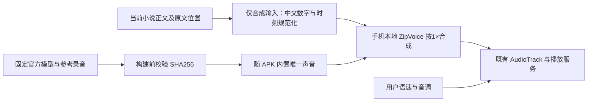

# 离线声音依赖与资源准备

本页维护生产语音资源、固定版本和可复现准备入口。产品状态与验收结论见[当前状态](../current-state.md)，接入历史见[ZipVoice实施计划](../superpowers/plans/2026-09-22-zipvoice-listening-upgrade.md)，当前性能候选见[发热改善计划](../superpowers/plans/2026-09-23-offline-listening-thermal.md)。

## 当前接入选择

2026-09-22按用户确认改接 **ZipVoice-Distill INT8／4步＋官方 `leijun-1` 参考声音**，音色标识为 `zipvoice:leijun`，界面显示“雷军”。这是参考录音条件下的合成声音，不是原讲话录音；不训练、不联网、不使用系统TTS。用户已认可同文电脑试听的听感，运行及连续播放结论由实施计划维护，不由本资源说明推断。

APK只包含这一套模型与一个参考音色。旧 `kokoro:*` 音色设置在读取时迁移到唯一音色，引擎也不再按旧值选择不同说话人。书籍、进度和其他设置不因换音源清除。此前Kokoro FP32／INT8选择和设备记录保留在[上一轮计划](../superpowers/plans/2026-09-20-offline-listening.md)；它们不是新版包内备用音源。

| 参数 | 固定配置 |
| --- | --- |
| 推理运行库 | sherpa-onnx Android 1.13.8，CPU，`numThreads=4`；9月23日三线程候选在1.45×真机长测未达温度／电荷目标且出现供给停顿，已撤回，见发热改善计划 |
| 主模型 | `sherpa-onnx-zipvoice-distill-int8-zh-en-emilia` 的 encoder／decoder INT8 |
| 声码器 | `vocos_24khz.onnx` |
| 参考声音 | 官方 `test_wavs/leijun-1.wav`，PCM16／24kHz／单声道／6.057秒 |
| 参考文字 | `那还是三十六年前, 一九八七年. 我呢考上了武汉大学的计算机系.` |
| 生成参数 | `numSteps=4`、`silenceScale=0.2`、`min_char_in_sentence=30`；模型固定自然语速1×，播放时应用用户语速与独立音调 |

现有AAR提供 `OfflineTtsZipVoiceModelConfig`、`GenerationConfig`、`generateWithConfigAndCallback` 及 `WaveReader.readWave(AssetManager, path)`，不需自写WAV解码或升级运行库。[固定版本Kotlin接口](https://github.com/k2-fsa/sherpa-onnx/blob/v1.13.8/sherpa-onnx/kotlin-api/Tts.kt)



ZipVoice合成接入只替换生成与初始化；焦点暂停、实际播放完成、停止取消、通知和预备队列仍走已有播放路径。原生回调在语音块计算后出现，取消不能中断正在执行的单次ONNX计算；旧结果必须在App侧取消检查后丢弃，不能因停止后计算完成而复播。参考声音特征由当前上游每次生成计算，是否造成实际等待以设备数据判断。[固定版本实现](https://github.com/k2-fsa/sherpa-onnx/blob/v1.13.8/sherpa-onnx/csrc/offline-tts-zipvoice-impl.h)

### 2×截短的已确认原因与处理

首次模拟器实播发现，同一34字测试句在模型 `speed=1` 时生成6.688秒，在 `speed=2` 时仅生成0.309秒，实际播放时长断言失败。这不是用户所需的正常倍速。官方[ONNX导出代码](https://github.com/k2-fsa/ZipVoice/blob/master/zipvoice/bin/onnx_export.py#L119-L128)按“参考＋目标”的总长度除以speed，而[sherpa 1.13.8](https://github.com/k2-fsa/sherpa-onnx/blob/v1.13.8/sherpa-onnx/csrc/offline-tts-zipvoice-model.cc#L132-L144)随后减去未缩放的参考帧。因此目标时长近似为 `(参考时长＋自然目标时长)÷speed－参考时长`；使用6.057秒参考时，这与0.309秒的实测一致。

修复保持模型和音色不变：先按1×完整合成，再用Android [PlaybackParams](https://developer.android.com/reference/android/media/PlaybackParams)设置实际播放速度，音调独立设置。当前语音单元保持开始时的参数快照，下一单元取最新设置；预备与取用均按1×生成参数索引，同一自然语音缓存不因改播放速度失效。没有用加长文本、裁短参考或降低用户速度掩盖问题。正式引擎的实际2×完整输出、短章尾及跨章录音已取得证据，具体范围和连续供给结果见[实施记录](../superpowers/plans/2026-09-22-zipvoice-listening-upgrade.md#执行记录)。

### 中文数字前端的补齐边界

真实小说实播中的“连着48小时”触发了数字读法调查：SenseVoice 将该处转写为英文数字；单次转写不足以确定具体错读成哪一个数，但固定版本源码确认了语言路径缺口。sherpa 1.13.8 的[拆词](https://github.com/k2-fsa/sherpa-onnx/blob/v1.13.8/sherpa-onnx/csrc/text-utils.cc#L316-L399)将连续 ASCII 数字保留为一个词；[MatchaTtsLexicon](https://github.com/k2-fsa/sherpa-onnx/blob/v1.13.8/sherpa-onnx/csrc/matcha-tts-lexicon.cc#L294-L317)将词典未命中、不含中文的词送入 `en-us` eSpeak。当前词典没有 `48`；前端还会把时刻中的冒号改成逗号。

官方 ZipVoice Python 入口在中文分段后使用[ChineseTextNormalizer](https://github.com/k2-fsa/ZipVoice/blob/master/zipvoice/tokenizer/normalizer.py#L149-L158)，通过 `cn2an.transform(..., "an2cn")` 转为中文读法；当前 Android 路径没有这一层。[ZipVoice 的固定版本实现](https://github.com/k2-fsa/sherpa-onnx/blob/v1.13.8/sherpa-onnx/csrc/offline-tts-zipvoice-impl.h)也没有加载、执行 `ruleFsts`，不能直接把旧 Kokoro FST 配置搬回来当作修复。

`ReaderTtsChineseNumberNormalizer` 在调用模型前处理含中文文本中的普通整数、小数、百分数、合法时刻以及紧接“年”的四位年份。整数读法采用局部确定性转换，覆盖0至999,999,999,999；前导零和更大的整数逐位读；英文相邻的型号／混合标识、纯英文文本、非法时刻及尚未支持的组合格式保持原样。例：`48小时` 对应“四十八小时”，`23:59` 对应“二十三点五十九分”。不引入 Python 运行时、额外模型、反射或下载依赖。曾尝试的 `RuleBasedNumberFormat` 不属于当前 Android SDK 公开 API，已在编译阶段排除，不能作为可直接调用的平台能力。

转换**只作用于合成输入**；小说原文、`ReaderTtsSegment` 的源区间、朗读完成和进度仍使用原始偏移，不把转换后字数当成原文位置。修复已通过6项 JVM 规则回归及对应 Android 构建；模拟器上正式引擎的1×／2×真实小说摘句实播均通过，独立转写均得到“四十八小时”“二十三点五十九分”。具体构建身份、音频证据与支持边界维护在[BUG-2026-061](bugs/BUG-2026-061-zipvoice-chinese-numbers-use-english-front-end.json)；这不代表所有数字语境、普遍发音质量或小米真机已经验收。

## 固定资源与构建入口

| 资源 | 固定来源 | 字节数 | SHA256 |
| --- | --- | ---: | --- |
| `sherpa-onnx-1.13.8.aar` | [官方发布](https://github.com/k2-fsa/sherpa-onnx/releases/download/v1.13.8/sherpa-onnx-1.13.8.aar) | 50,129,134 | `633c24321e06b1fe79feafa03ea16cbc0f8a286641e2da3559bac91bdb13bd96` |
| `sherpa-onnx-zipvoice-distill-int8-zh-en-emilia.tar.bz2` | [官方发布](https://github.com/k2-fsa/sherpa-onnx/releases/download/tts-models/sherpa-onnx-zipvoice-distill-int8-zh-en-emilia.tar.bz2) | 109,162,785 | `77219c8b40f4ee8d73a7f902305ff6c1128ef9b54461c41b4ca6ed890b6c2803` |
| `vocos_24khz.onnx` | [官方发布](https://github.com/k2-fsa/sherpa-onnx/releases/download/vocoder-models/vocos_24khz.onnx) | 54,157,409 | `bcb3b970e384161c4d634f0bb9e999ff1c471b34c9bc0b1049a5014065ed3cc0` |

使用[准备脚本](../../scripts/prepare-offline-voice.sh)，资源准备和Gradle构建串行：

```sh
# 优先复用试听已有的解包模型；目录内须含模型目录与vocos文件。
# AAR复用.local-tts/runtime内的固定版本。无网络、不会修改输入文件。
scripts/prepare-offline-voice.sh --extracted-models '/Users/longshengxi/Downloads/StoryApp-TTS试听-2026-09-21/models'

# 或使用包含上表三项完整下载的目录。
scripts/prepare-offline-voice.sh /path/to/completed-downloads

# 新环境从固定官方地址下载，复用已有下载缓存／有效运行库。
scripts/prepare-offline-voice.sh
```

原模型压缩包摘要继承9月21日完整下载记录；解包模式进一步验证encoder、decoder、tokens、lexicon、参考WAV和vocoder各自固定摘要，以及全部eSpeak文件内容和相对路径的合并摘要。各值唯一维护在准备脚本。输入不匹配直接退出，不覆盖输入或发布部分模型。

脚本完成暂存后发布以下目录，删除其管理的旧Kokoro assets，避免两套同时进入APK；不删除下载源、无关assets或应用数据。只复制唯一参考声音，不把官方女性样音一并打包。原ZipVoice下载包没有 `LICENSE` 文件，依赖来源保留在下节，不伪称包内已提供许可文件。

```text
.local-tts/
  runtime/sherpa-onnx-1.13.8.aar
  assets/sherpa-onnx-zipvoice-distill-int8-zh-en-emilia/
    encoder.int8.onnx
    decoder.int8.onnx
    vocos_24khz.onnx
    tokens.txt
    lexicon.txt
    espeak-ng-data/
    leijun-1.wav
```

模型、词典、参考WAV从 `AssetManager` 读取；`espeak-ng-data` 首次准备时复制到应用私有目录的版本专属路径，完成后记录ready标识。中断后重试补齐，不复用旧Kokoro的ready。手机听书不触发下载，二进制依赖不提交Git。

官方AAR含四种ABI，当前交付仅打包 `arm64-v8a`；目标手机与本轮API34模拟器均为ARM64，不附带未使用的x86_64原生库。包大小与生成速度是不同指标，不以INT8或包变小推断体验更快。

## 来源与许可记录

当前用途是个人自用，按用户要求优先完成功能和体验；来源记录供维护，不额外增加验收门，不变更本项目许可证。

| 依赖 | 来源与声明 |
| --- | --- |
| ZipVoice／Distill模型 | [项目](https://github.com/k2-fsa/ZipVoice)、[模型卡](https://huggingface.co/k2-fsa/ZipVoice)、[sherpa模型说明](https://k2-fsa.github.io/sherpa/onnx/tts/zipvoice.html)；模型卡标Apache-2.0，ONNX与参考声音来自上述固定官方包 |
| Vocos | [原项目](https://github.com/gemelo-ai/vocos)声明MIT；使用sherpa发布的24kHz ONNX资源 |
| sherpa-onnx 1.13.8 | [代码许可](https://github.com/k2-fsa/sherpa-onnx/blob/v1.13.8/LICENSE)Apache-2.0；不能概括整份AAR所有依赖 |
| ONNX Runtime 1.28.2 | [代码许可](https://github.com/microsoft/onnxruntime/blob/v1.28.2/LICENSE)MIT，保留该版本ThirdPartyNotices来源 |
| piper-phonemize | 固定提交 `f3ff95afc03640bc1399e113e83361192a2fafb4` 的[许可](https://github.com/csukuangfj/piper-phonemize/blob/f3ff95afc03640bc1399e113e83361192a2fafb4/LICENSE.md)MIT |
| eSpeak NG | 固定提交 `ed530aa113046142eb5115cf2fc9157854d0ffe1` 的[许可](https://github.com/csukuangfj/espeak-ng/blob/ed530aa113046142eb5115cf2fc9157854d0ffe1/COPYING)GPL-3.0，已编入当前JNI |

固定依赖链来自sherpa v1.13.8的[构建入口](https://github.com/k2-fsa/sherpa-onnx/blob/v1.13.8/CMakeLists.txt)、[eSpeak配置](https://github.com/k2-fsa/sherpa-onnx/blob/v1.13.8/cmake/espeak-ng-for-piper.cmake)和ZipVoice前端。未来公开分发时按实际二进制、模型和参考声音核对条件；本轮自用不将这一未来事项设为交付阻塞。
