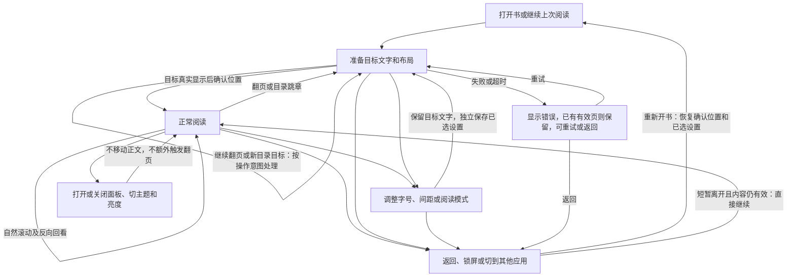

# 纯阅读性能与交互缺口优化实施计划

日期：2026-09-14。状态：实施完成，必要证据及交付摘要见第7节；代码已于9月20日随`a1a2538`（测量复用）与`d8848fe`（阅读交接及听书接线）提交并推送。滑动适配、模式执行权、带排版条件的失败回退均已落地，此前实验及阅读流程图保留。以下为本轮批准的实施合同。

基线：已推送的 `8c0e210`，阅读实现为 `e9b9498`。当前授权为实施本计划并交付代码、长期回归与debug/本地签名release APK。[当前状态](../../current-state.md) 负责项目优先级；稳定规则见 [协作约定](../../knowledge/agent-operating-agreements.md)。

## 0. 本轮为何补充操作梳理

“上一章末页↔下一章首页”本就在第一阶段纯阅读目标中，不是用户后来新增的功能。之前遗漏主要来自执行与判断方式：

- 把已知缺陷关闭、定向测试通过，当作阅读流程已经充分覆盖。交付应说明已证明的范围，不能让“阶段完成”隐含常用操作的交错时序也已验证。
- 偏重最终正文/位置正确，未总是把输入被接受、等待、动画显示、标题确认和进度写入连成同一过程；正文先出现不代表导航已经结束。
- 滑动设备测试用三个单页短章，而且每步等待正文、标题与磁盘确认；连续输入主要测点击。字号测试直接挂分页组件，绕过完整ReaderScreen的设置、模式切换与内容接线。上述证据有效，但不足以代表用户不等上一动作完成就继续操作。
- 看到缓存就默认命中很快，看到取消就默认旧工作不再影响新操作；没有继续检查缓存之前的锁、不可抢断调用及不同终态的后续处理。

这次不再按“两个技术点”定义交付，而是以现有常见纯阅读操作为范围，技术改动服务于这些操作。已确认缺陷和具体待验证接缝同轮关闭，不把它们转交给用户日后遇到再报。

| 真实操作组 | 必须连起来看的过程 | 本轮证据安排 |
| --- | --- | --- |
| 打开书、目录跳章 | 首次/缓存命中、正文未就绪时继续导航 | 继承正常启动和导入证据，补未准备目标的阅读输入 |
| 同章/跨章前后翻 | 点击、有效滑动、短拖动取消、前一动画未结束的连续/反向输入 | 长短章边界＋外围重章，核对明确最终文字及过程 |
| 自然滚动跨入长章、反向回看 | 普通纵向拖动进入真实长章、往回看几段，停下立即离开再恢复 | 复用现有真实书的一处代表长章；检查可感知停顿、空白/跳动及恢复文字，正常则结束，不预设滚动重构 |
| 目录或章按钮覆盖导航 | 旧点击/旧手势不能追加到新目录目标；按钮可用性与操作基准一致 | 一条未完成导航→覆盖→再翻的真实入口序列 |
| 字号/行距/段距、旋转 | 保留最新目标文字，旧布局不确认新请求 | 继承组件等价证据，补完整设置入口的交错操作 |
| PAGE↔SCROLL | 当前显示模式与用户已选模式分开，内容列表身份匹配，目标文字不丢 | 补待跳章时切模式、待翻页时选模式并立即退出 |
| 返回、后台、失败与重试 | 最后有效文字和已接受设置分别保存；锁屏/切应用回来可继续读，回书架换书不串位置；旧任务不回写，失败不被无关设置吞掉 | 合并进模式/导航序列，短暂离开选一个代表入口，宿主进程退出只补受影响接缝，不穷举系统中断组合 |
| 面板、日夜、亮度 | 不穿透、不重排正文、不偷走导航意图；系统返回先收面板 | 继承基本控件证据，在上述进行中的阅读操作中覆盖接缝 |
| 正文与章节数据 | 页面完整、分章读写保持原义、不同规模下可读 | 继承九本导入重载；本轮重验受影响的真实页面完整性 |

不逐项笛卡尔积，不要求每本小说跑全部操作。使用一组长/短/长章节、一个多段长章和一个超长单段组织代表序列，已有测试负责其擅长的直接结论。

### 用户视角复核后的范围收口

本轮只纳入会改变阅读结果或明显打断阅读的事项：正文缺失/重复/裁行、错误位置或丢进度、需要重复操作才响应、明显跳闪/空白、可重复的等待或卡顿。正文及进度错误即使不高频也保留；没有可感知影响、没有明确性能代价的动画细调、像素整齐度和代码形式统一不增加任务。通过已有证据能确定且未受影响的路径直接继承，不因为本轮画图再重测一遍。

收口核对仅新增上表一条自然滚动长章路径。依据是当前 `ScrollReaderContent` 的 LazyColumn 按整章分项，`ReaderParagraphContent` 内部 Column 布局该章全部段落并汇总行指标；它与待优化的分页计算不同。现有连续滚动测试用十个短段落接一个短段落，精确恢复测试及进程恢复证据继续有效，但不证明自然跨入真实长章的响应。该结构事实不等于已发生卡顿。用已有真实书中有代表性的长章走通“进入→反向→停下立即离开→恢复”，无明显异常即停止；只有观察到实际影响才定位最小必要修复，不预设段落懒加载或新的性能专项。退出时 `captureProgress()` 已当场读取真实可见行，`leaveReader()` 等待保存；保留这项保护，不新增一个没有依据的丢位置缺陷。

### 阅读过程与中断图

下图描述**本轮操作合同和检查位置，实际证据与限制见第7节**。按用户操作画流程，并单独列出等待与失败分支；节点对应上表及S1–S4，不另建一份架构或用例清单。

重点看三段：正常读到下一章是否顺畅；尚未完成时下一次输入是否按意图处理；离开再回来是否仍是应读的文字。已准备的章末/章首往返同时检查响应；自然滚入长章检查另一条显示路径。实现和验证按这些过程对照，细节不影响上述结果时不追加优化。

## 1. 决定、目标和停止线

**选择：减少段落复测、让已准备章节直接命中，并补齐手势、待到达目标、模式切换和退出保存的操作交接。保留完整章节分页与单一Pager，局部调整输入和状态交接。**

主类型：阅读问题修复；次类型：性能优化。必要重构只是修复手段，不增加第三套验收。主结论是上述常用操作在准备中、连续输入和中断时仍按意图显示并保存，同时减少长章重复测量，取得固定设备/输入下的可测计算收益。

分页性能部分聚焦有效请求自身的计算。[BUG-2026-050](../../knowledge/bugs/BUG-2026-050-obsolete-pagination-delays-reflow.json) 已处理“取消后仍算完整章”的阻塞，本轮继承该证据，另外处理缓存命中等待与操作交接，不能将原修复泛化为所有等待均已消除。上一轮约3秒只是特定模拟器窗口的单次计算时间，不作为本轮固定基线，也不是框架性能下限。

必要不变量：

- 相同正文、排版参数下，页面顺序、原文区间、可见字符位置与改前一致，不能用漏字、重复或裁行换速度。
- 每页仍按真实渲染方式校验页底，原逐行回退、空白规范化和取消检查保留。
- 目录覆盖、连续翻页按输入时排版求目标、章末反翻、内部窗口重置及有效进度保存的语义不变。
- 上一章末页与下一章首页都已准备后，固定排版下反复往返不重复计算这两章，缓存读取不依赖外围邻章预计算结束；正文、标题与确认进度始终对应同一页。
- 预览页尚未准备不等于真实书首/书尾；已接受的翻页意图不能因缺少预览而消失。短拖动、取消仍不算翻页。
- 新目录目标覆盖旧导航；重排保留原意图，两者不能统一为“请求编号变化就全丢弃旧输入”。成功、失败和取消分别处理。
- 用户已接受的设置独立保存，阅读进度只保存最后确认的文字；准备中的模式切换不能读取旧模式列表后误报目标不存在。
- 测量数据仅属于本次计算；不跨书、跨字号或在线程之间共享可变测量器，不发布取消后的部分结果。

不做渐进分页、从目标位置重新起页、倒排末页、全书预分页、分页规则重写、换框架或升级依赖；不改听书、存储格式和分章规则，不预设重做滚动布局算法。允许修正模式切换与设置/进度的交接，以及上述代表路径证实的局部阅读阻碍；若直接证据表明必须改变已排除的结构，先写清原因和修订边界，不自行启动重写。不得扩大为加载或缓存平台。

**实施完成停止线：**第0节代表操作和下述4处交接疑点均有明确结论：成立的缺陷已修复并有对应运行证据；排除的疑点有真实路径或已确认防护依据，不能仅写“未复现”。页面区间等价、实际文字完整性及关联恢复通过，多段落收益达到第5节标准，单段/普通输入无可确认的新退化，独立实现检查实质问题关闭。达到后停止；函数提速或测试数量不能替代操作完成，也不扩成一般性能平台。

## 2. 已确认事实与必要取证

### 实施前基线能够直接确定的部分

1. `ChapterPageCalculations.pages()` 在整章 `List<ReaderPageSlice>` 完成后才返回；`resolve()`、上一章末页与下一章首页都依赖完整结果。因此目标页等待整章是应用结构选择，无法据此认定是 Compose 硬限制。
2. `paginatePageSlices()` 先通过 `ReaderPageTextLayout.measureLines()` 测完整章；随后 `pageTextFitsViewport()` 对每个候选页再分段、测量、创建行列表，最终只使用最后一行的底部坐标。若装不下，每退一行又重复该过程。
3. 实际 `ReaderPageSurface` 对 `page.rawText` 独立分段并渲染。完整段落在同输入、同排版下可复用；跨页截断后的文本是另一个测量输入，不能简单平移整章行坐标。
4. 现用 Compose ui-text-android 为1.10.4，本地二进制确认 `TextMeasurer` 默认缓存容量为8。它按文字和布局输入复用结果；文字、字号、约束变化会产生新布局。[Android 官方 API 说明](https://developer.android.com/reference/kotlin/androidx/compose/ui/text/TextMeasurer)。默认小缓存并不能保留整章上千段供第二遍复查。
5. 用户补充的常用操作是“A章末页↔B章首页”。两章都属于任一中心的保留范围，但 `pages()` 目前先获取计算锁再查缓存；外围C/D章准备持有同一锁，取消又要等当前测量调用返回。因此已缓存页面的位置确认存在等待无关计算的代码路径。原生滑动可先显示预览，不代表标题/进度已确认；这项控制流事实尚不等于实测卡顿程度。

代码入口：[测量](../../../app/src/main/java/com/longerlsx/storyapp/feature/reader/ReaderPageTextLayout.kt)、[逐行分页](../../../app/src/main/java/com/longerlsx/storyapp/feature/reader/ReaderPageLinePaginator.kt)、[页面复查与渲染](../../../app/src/main/java/com/longerlsx/storyapp/feature/reader/ReaderScreen.kt)、[调度](../../../app/src/main/java/com/longerlsx/storyapp/feature/reader/StablePageReaderContent.kt)。

### 方案阶段的运行实验（继承证据）

未决问题：完整段落复测是否值得先优化；如果主要耗时来自不可复用的原始整章测量，才需要重新比较渐进方案。旧总 trace 无法拆分这个问题。

临时 Android 测试直接调用生产 `ReaderPageTextLayout.measureLines` 与 `ReaderPageLinePaginator.paginate`，复查回调沿用相同生产测量和高度判定。只改变 `TextMeasurer` 缓存容量8/4096，记录整章测量、复查、总计算墙钟与线程CPU时间、复查次数，比较所有页面原文区间。4096是证明重复计算可消除的实验变量，**不是拟议产品配置**。

环境：任务专用 StoryPaginationDesign 模拟器，API34、arm64、1080×2400、420dpi、2048MB、host GPU，宿主 Apple M1 Pro，开始准备时负载约3.2/3.4/3.5。基线 debug 代码，无录屏、系统 trace 或并行 Gradle。使用 `Dispatchers.Default` 独占测量器，固定密度2.625、字体缩放1、22sp、33sp行高、宽954px、高2000px、段距51.975px、LTR；这些是函数实验约束，不冒充正常阅读区域测量。

正式样本前先用短文本预热一次；每组按8→4096→4096→8→8→4096运行，每次新建测量器，每种容量3次。不剔除首次样本、不据小样本报告p95。一次测试完成18次分页，4.723秒，0失败；三组每页区间全部一致。

| 输入 | 页数 | 复查段落测量调用 / 可匹配已测完整段落文本 | 容量8：复查耗时 | 容量4096：复查耗时 | 容量8 / 4096：总计算耗时 |
| --- | ---: | ---: | ---: | ---: | --- |
| 50,407字符、1,201段 | 190 | 1,327 / 1,075 | 313–488ms | 54–67ms | 635–1,174ms / 327–475ms |
| 22,807字符、单段 | 59 | 59 / 0 | 21–28ms | 22–27ms | 32–54ms / 33–42ms |
| 25,431字符、180段长短混合 | 68 | 238 / 136 | 54–57ms | 34ms左右 | 98–111ms / 76–79ms |

三组均未触发候选页回退，因此本次实验不证明回退路径。多段落组第一次整章测量669ms，后续不同容量下264–396ms，说明运行时预热/调度仍有波动；不把原始首遍变快归功于页底复用。超长单段没有稳定同类收益，不推广多段落结果。

输入可重建：多段落沿用上一轮 `段落标记NNNN。这是一段用于稳定复现分页开销的确定性文字，文字顺序必须保持完整。`，编号0000–1199，每段换行，结尾 `章尾唯一标记。`；单段沿用已有完整性测试的1200次 `连续段NNNN：甲乙丙丁戊己庚辛壬癸。` 加 `章尾唯一终点。`；混合组沿用 `manyUnequalParagraphsKeepTheirOrderWithLargeParagraphSpacing` 的180段生成规则。没有复制小说原文进入仓库。

**方案阶段的结论边界：**该实验只证明重复完整段落测量存在足以改变路线选择的成本，当时尚未实现轻量复用，也未验证其实际页面渲染、内存实测或正常用户操作时延。它不复现或解释上一轮3秒的全部构成，不证明小米性能，不证明4096容量适宜长期使用。实施后的独立结论见第7节。

## 3. 具体实现方案

### 一次测量保留轻量指标

在当前单章计算内，按已有 `ReaderParagraphModel` 分段，真实测量每段一次。保留当前分页所需的行列表，另为每个完整段落保留：原文起止区间、`layoutResult.size.height`、`layoutResult.getLineBottom(lastLine)`。这些数值在取得同一 `TextLayoutResult` 时顺便记录，不再额外测一次。

不保存整章所有 `TextLayoutResult`，不扩大默认缓存到4096。轻量表局限在本次 `paginatePageSlices()` 调用，结束或取消即释放；现有章节缓存仍只保存最终页面。现有 `measureLines` 的调用语义保留，测量公共步骤由内部小函数复用，避免两套样式、分段与行坐标算法。

### 页底复查只求高度

对候选页仍调用同一 `ReaderParagraphModel.toDisplayParagraphs(page.rawText)`，保留首尾空白处理；把段落局部区间加上页的原文起点，查找本次完整段落表：

- 区间完全匹配：直接用已测段高与最后行底，无需再次调用文字测量。
- 不匹配：这是页面边界片段，按相同文字、样式、宽度、密度、方向和字体解析器真实测量，只提取段高与最后行底，不创建整份 `ReaderPageLine`。
- 按段落顺序逐项累加前面段落的整数 `size.height` 和原段距，最后加末段 `lastLineBottom`，得到与当前检查同定义的页底。

不使用“整章末行底减首行顶”的近似，不重排浮点加法或用行高相乘代替；候选页遍历的是页内少量段落，不为此再建设前缀和或搜索索引。

一个候选页至多有两个被截断片段，首尾来自同一段时只有一个。逐行回退仍走原逻辑；当前候选页序列只保留不变页首片段的轻量测量结果，尾片段变化时重新测量。跨到下一页即丢弃上一页片段记录，不累积所有回退候选或长段切片缓存。

### 已准备章节直接命中，未准备章节继续原计算路径

`ChapterPages`、`ReaderPageSlice` 和完整章节结果保持不变。`ChapterPageCalculations.pages()` 先检查取消，再在原UI调用线程查缓存；完整结果命中就返回，未命中才进入现有Mutex。锁内再次检查取消和缓存，避免等待期间别人完成同一结果后又重算。

这个缓存的线程安全前提是：UI线程读取、淘汰及发布结果，后台只计算局部值，`withContext(Default)` 返回后才写缓存。保留该前提并写明，不把普通Map的锁外访问推广成任意线程安全；不把整个resolve移到后台。

新增测量入口继续传递当前计算的CoroutineContext，保留段落前后、候选页和回退边界的取消检查；命中复用也不能跳过取消检查。单次原生测量仍不能中途抢断。消除缓存读取的锁等待不等于消除所有CPU或显示竞争，实际操作仍需验证。

测量改动集中在 `ReaderPageTextLayout.kt`、`ReaderScreen.kt` 的分页辅助函数，以及 `StablePageReaderContent.kt` 的完整结果命中顺序；如为共享内部测量结果类型需要小幅调整 `ReaderPageLinePaginator.kt`，不得改变候选选择和回退语义。下面的操作修正允许局部调整手势与请求交接，保留单Pager与外围章节保留范围。

### 已批准的滑动与模式交接实现

**S1/S2：释放时接受一次翻页，一个目标驱动导航与吸附。** 保留单HorizontalPager拖动，现有正文触摸入口只观察单指水平手势，不消费Pager拖动；排除短按、长按、多指和取消。按页面宽度/密度/Pager方向归一化位移d与速度v；低速仅当abs(d)>0.5才翻，快速门槛400dp/s，向前速度取ceil(d)、向后取floor(d)，结果夹在[-1,1]。新手势不包含旧动画残余偏移，新的取消不撤销已接受输入。

局部TargetedFlingBehavior复用Compose标准吸附动画，只吸向共同请求的缓存解析目标；不再由原生fling独立选另一目标。未准备时依次保留窗口内的前一已接受目标、手势来源页、最后确认页，均不确认新进度；后台完成后无动画换窗，不加空白占位页。缓存与后台解析共用一套逐步导航算法，缓存缺失即返回，不做IO或启动计算。

内部增加navigationEpoch、inputRevision及手势/动画归属：目录覆盖使旧手势失效，重排保留已接受输入；动画取消只清理自己，不撤销turn或自动reflow。最终仍核对请求编号、真实目标布局与手势/吸附终态。先跑通冷邻章、短拖动和动画中反向的现有回归，避免最后才发现适配不可行。

**S3/S4：selectedSettings独立保存，activeSettings只管理实际显示。** 所有阅读/主题/亮度及已有TTS设置回调从selectedSettings复制并立即交给原串行存储。退出仅提交已确认锚点与实际显示模式的不可变快照，等待已提交设置和进度；重开按最新选择映射锚点。

按书持有已有分页计算器与确认显示状态。旧画面保留不代表旧任务继续：无未解析按页导航时立即交接执行权限并刷新请求编号，停止旧定位/确认/报错/自动重排和邻章准备。只有依赖旧分页的turn或末页目标，先按输入时排版求锚点，再交给目标模式；不强制先在旧模式显示和确认。目录覆盖旧目标，取消只结束旧任务，失败保留原请求；主题/亮度/TTS参数不清错或隐式重试。

feed增加书籍、模式、PAGE所需章节、重试世代的key，及带key的Loading/Ready/Failed。只用匹配Ready定位及判断缺章，旧结果/异常不能影响新目标。数据未准备时保留可读内容。

**失败回退：锚点是依据，像素只是条件匹配时的快捷方式。** 确认快照含书与正文/列表身份、锚点/模式、排版参数和标识、视口尺寸/内边距、分页窗口或滚动章节身份/像素视口。只有上述条件匹配才复用几何；字号/间距/宽度变化后按确认文字重新映射，禁止旧偏移套新布局。回退不清原错误或重试目标，不更新有效进度，不回滚selectedSettings。回退自身失败即停止自动恢复，提供重试/返回，不循环跳章首。沿用原定位算法，不新建恢复框架。

### 4处操作接缝的基线事实与直接证据

这些来自实施前的两项独立只读调查，**当时尚无新增设备复现，不统一标为已发生的bug**。后续实际复现、修复和验证结论见第7节。

| 接缝及触发 | 已确认的代码事实 | 本轮最小处理与直接入口 |
| --- | --- | --- |
| S1：A末页已显示，B未准备时立即向B滑动 | `ChapterPageWindow` 只加入有缓存的邻章；滑动按settledPage距离补发turn，距离0不产生新目标 | 短A/长B一次有效滑动进入B，同位置短慢拖动仍取消；按上文统一释放判定与吸附目标实现 |
| S2：前一滑动尚未确认就继续、反向，或目录覆盖后再翻 | 新Drag.Start覆盖旧手势，完成时向当时最新request追加turn | A2→B1→C1输入前/前/后最终B1；目录覆盖后从目录再翻；重排保留目标，内部换窗不多翻；不逐步waitForIdle |
| S3：已确认A→目录跳B未完成→切SCROLL | 模式延迟只检查turns，feed没有加载身份；保留旧PAGE组件仍可能执行B分页 | 完整ReaderScreen中切SCROLL继承B文字；旧分页不参与目标，旧完成/异常无效；含turn仅先求锚点再交接 |
| S4：待翻页时选择SCROLL，立即返回或后台退出 | 所选模式可能只保存在remember；request为空也未区分成功/失败；滚动回退只有项索引与像素偏移 | 选择SCROLL→改字号/主题→立即返回重开；所选设置保留且不保存中间位置；模式/字号/宽度变化后失败回退确认文字，原错误/重试目标保留，宿主进程终止仅补受影响一条 |

S1/S2主要入口是 `StablePageReaderContent` / `ReaderPositionState`，S3/S4主要入口是 `ReaderScreen.updateReaderSettings`、feed与退出接线。使用原设置存储和进度提交接口，不建新框架。修复前写清实际失败；已有代码足以证明的等待/未保存关系不再另写验证器，事件顺序、画面与生命周期则取得运行证据。

若某个疑点在真实调用中被已有机制阻止，记录触发条件、实际防护和对应证据后关闭，不为预设猜测改代码。一次重跑变绿不算解释原失败。

## 4. 没有选择的路线

| 路线 | 本轮判断 |
| --- | --- |
| 直接把TextMeasurer缓存加大 | 实验已证实可消除重复工作，但会保留大量完整布局；轻量段高复用更明确地控制生命周期和内存，避免把实验容量当产品经验值 |
| 先出目标页、随后补全整章 | 能缩短部分章首等待，但新增“已准备末页不等于章尾”、续算、部分失败、旧排版待执行翻页和Pager追加语义；当前局部收益已经有证据，先不承担这类改动 |
| 从目标段直接起页或从章尾倒排 | 会改变稳定页面边界。例如25行、每页10行，现有末页是21–25，倒排会变成16–25；不符合本轮不变量 |
| 删除页底复查、固定字数分页 | 破坏实际排版与裁行保护，排除 |
| 改字体框架、并行共享测量器、全书缓存 | 没有相应根因证据，增加兼容、线程或内存成本，排除 |

若局部方案达标即停止；若达不到，不自动追加下一种重构。先明确剩余成本是否在原始整章测量、边界片段或显示阶段，再单独修订方案。

## 5. 实施顺序与最小直接证据

1. **先关闭操作取证缺口，固定实现前对照。** 用现有真实ReaderScreen/导航入口定向确认S1–S4，记录明确目标与必要的事件时序；不要先改实现再找解释。同时取同输入/同设备/同排版的改前函数及正常操作数据。当前debug函数实验用于选路线；体验前后比较使用同一种非调试构建，不与上一轮异常模拟器数据混算。
2. **实现已确认的最小操作修正、轻量复用及针对性回归。** 操作缺陷按同一接缝成组处理，不逐个发版让用户验证。分页部分证明原文区间相同、完整段落不重复测、边界片段仍测、候选回退保持页底定义、取消不返回部分结果；使用真实文字布局验证边界，不只用伪造行高。
3. **验证实际渲染与完整界面接线。** 运行 `ReaderPageContentIntegrityTest`，保留混合段、空行、32sp章尾、超长单段和大量段落。针对新增复用补入同页跨段、段内截断、页尾回退及带空白/中英标点的直接案例。`ReaderPageReflowTest` 继续证明分页组件目标，新增模式/退出交错必须经过ReaderScreen设置、内容及保存路径；不能用直接改组件参数代替。补第0节自然跨入真实长章的滚动序列，沿用已有设备入口和样本，不另建脚本；如出现可重复的明显显示停顿，先记录输入、设备和触发过程，再按具体疑点使用现有帧数据或系统轨迹，冻结对应口径后修复，不套用分页函数收益指标。设置、退出和进程恢复只重验受影响接缝；导入、九本重载、声音及未受影响的滚动正确性证据继承。
4. **把跨章来回翻作为核心实际操作。** 扩展现有 `ReaderPageModeTest` / `ReaderNavigationInteractionTest` 中匹配的入口，使用明确的A章末页和B章首页：正常读到边界后连续前后点击和快慢滑动；目录跳到B首页后立即回A末页；在边界改字号再往返。长短章混合，并在外侧放一个计算较重的C或D章，检查A/B已准备时不会因外围预计算拖延确认。每步核对目标原文区间、正文/标题和确认进度；动态观察不能出现空白或先跳章首。次数只覆盖窗口两侧切换及连续输入，不固定长时间循环。已有总分页trace用于核对A/B没有新计算；如需区分锁等待，优先为既有入口增加最小标记或定向并发测试，不建立独立导航验证器。
5. **做同构建类型对照。** 看原始段落测量、页底复查、总分页三个累计值，以及首次打开/连续改字号/上述跨章操作的真实目标确认。分别记录首次缺少章节结果的准备等待和两侧已经准备后的往返，不能用预先等待全部完成的测试代替首次路径；不重跑上一阶段全部操作矩阵。

性能口径在产品实现前冻结如下：

- 主输入固定为上述50,407字符/1,201段；辅输入为单段与180段混合组，再使用已有最大真实书的一个章节检查真实接缝。不重扫九本全文、不申请新小说。
- 核心算法比较先预热一次，再按改前/改后交替顺序各3次，使用新的本次计算对象；记录全部样本与中位数，不事后删慢样本。首次正常开书单独保留冷启动样本，不与热函数中位数混用。
- **主输入页底复查中位耗时至少降低50%，总分页中位耗时至少降低25%。** 此目标在轻量复用实施前确定；实验的复查区间差异支持其可行性，但不预先宣称已经达标。
- 单段和混合输入：不得出现可重复的总计算退化。若中位耗时上升超过改前重复样本的最大差值，先定位再判断；若改前最大差值已超过中位数20%，本窗不能作定量验收，先解决环境或采样可比性，不能顺势放宽标准。
- 正常操作仍核对首次稳定目标、最后字号对应文字、跨章正文/标题一致且无超时。计算完成时间不能冒充画面稳定时间；需要稳定显示时点时沿用真实请求布局确认入口，仅做最小标记。没有可信呈现数据就不声称上屏改善比例。
- 第0节以真实操作结果收口：输入有明确接受/取消结论，过时结果不改最新目标，正文/标题/位置确认对应，退出恢复保持最后有效文字与已接受设置。组件用例、控制时序替身和正常设备路径各自注明范围。开面板、主题/亮度等已有证据只在交错序列中核对直接接缝，不重新逐项普查。
- 内存通过生命周期和必要设备分配观察检查：不新增整章布局结果常驻、跨书布局缓存或随回退次数增长的片段记录。只有出现分配/GC疑点才扩充一次局部观察，不建设内存基准工具。

新增临时命令或探针仍须先说明会改变哪个判断；正确性与性能各自提供直接证据，不固定重跑完整项目套件。相关最终代码已通过的证据不因文档整理或提交而重跑。

## 6. 委派、预算与本轮交付

两项独立只读调查分别负责测量/渲染等价性、调度/渐进分页取舍，均已结束；不改产品或自行增加验证。书面方案的一次独立检查已完成，未发现改变路线或阻止实施的实质问题，确认页底定义、取消、片段生命周期及实验结论边界一致。用户随后补充跨章往返场景，只追加核对缓存命中与计算锁这一具体调用关系，并据此增加最小命中顺序调整；没有重新审查全案或追加运行探针。实施时按改动范围安排一次正确性与测试缺口检查，复用本轮取证，不递归审查。

用户进一步要求主动检查常用纯阅读操作后，又分派导航输入全过程、模式/恢复交接两项独立只读调查，得到S1–S4；这是补足原目标下遗漏的操作调查，不是审查上一层审查。本次未新增临时代码或运行测试。第0节和S1–S4是修订后的实施边界，原独立检查不能冒称已经审查新增实现；实施检查须覆盖这些具体变更，仍只做一次必要检查。

**一次性验收代码预算：预计160行（含本轮方案探针），硬上限800行；默认不进入仓库。** 全部代理合计，临时测试、注入配置和后续新增探针一并计算；达到停止线按协作约定处理。长期直接产品回归不计入，不把一次性对照框架改名留下。

方案阶段临时代码累计124行，继续计入整个任务预算：测试105行、最终Gradle注入9行、被替换的注入1行、AVD入口3行、复制配置中实质修改6行。首轮注入没有把Kotlin类编入测试包，得到ClassNotFound；改为直接追加至现有Kotlin编译任务后成功，此失败不作为产品问题。方案阶段专用设备已关闭，`/private/tmp/story-pagination-design-20260914` 中所有临时源码、构建和运行文件已删除；当时原Pixel_8及第一阶段APK保持不变。实施阶段预算和清理在第7节汇总。

交付代码、长期回归、debug APK与按既有方式签名的release APK，记录最小验证摘要与限制。S1–S4、模式执行权和布局变化回退、代表阅读操作、真实长章滚动检查均有明确结论，性能达冻结标准，相关回归及一次独立实现检查收口后停止。当前状态维护最新结论，计划维护执行证据，确认缺陷更新对应记录。统一检查文档矛盾、过期状态、意外文件和临时产物；原文/全日志/临时报告不入docs。Git交付遵循会话已有授权边界。

## 7. 本轮实施记录

- 2026-09-14：已合入批准版合同，尚未改产品。工作区已有三份本轮文档修改/新增及两份无关历史未跟踪计划，均保留。ADB首次启动受沙箱socket权限限制，按环境规则提升执行权限，不归为产品故障。
- 实现前定向取证：冷邻章一次滑动用例在旧实现超时；等待翻页时选择SCROLL/20sp并立即退出，磁盘模式仍为PAGE。两项回归先取得有效失败，再实现。分数段距区间等价及实际页底回退的两个真实测量案例在改前已通过。
- 首版构建及位置状态单测通过。首批13项设备回归中11项通过，包括冷邻章一次滑动、连续/反向滑动、后续取消不撤销输入、待翻页重排、设置退出及字号变化后的失败回退；一项目录用例需按正常界面重新打开控制栏，一项书首顺序的标题确认当时失败。两项测试入口问题随后已收口，见下文关联结果。
- 性能校准：短文一次预热后的debug成对对照，主输入基线总耗时为1073.870/599.147/603.541ms，最大差超过中位数20%；该窗不作定量验收，原始样本全部保留到本次收口。下一窗在同一种本地签名release构建下，对每种完整输入的改前/改后路径分别预热一次，再按原交替顺序各测3次；冻结的50%/25%及波动标准不变。此调整用于消除已观察到的运行时预热差异，不剔除慢样本或放宽阈值。真实开书冷态单独观察。
- 关联收口：模式5项、错误/设置/字号旋转恢复3项及release导航7项均通过。先前标题查询失败的补证显示正文、精确头部描述及磁盘锚点已一致，测试改为等待精确头部描述和磁盘同时匹配；没有因此修改产品。独立实现检查的章按钮启用基准已修正并通过原模式用例。
- 完整输入预热的release校准仍出现基线突增：主输入120.977/113.641/184.121ms；补线程CPU后的窗为149.379/119.589/127.477ms，仍超20%，且CPU自身也变化，不能只归为宿主等待。单段两个窗口的现代中位数均略高（约0.7ms），保留待判定，静态核对未发现新增全文遍历/重复测量。下一窗对相同APK及同时包含改前/改后算法的测试包统一执行Android `cmd package compile -m speed -f`，明确排除运行中编译变量；仍保留全部样本、完整输入预热一次及原阈值，不以无效窗宣称达标。

### 正式分页结果

环境为本轮专用StoryReaderOptimization模拟器：Android14/API34、arm64、1080×2400、420dpi、60Hz、2048MB/4核、host GPU；宿主Apple M1 Pro，release准备期间负载约4.49/5.09/6.07。无并行Gradle、录屏或系统trace。排版沿第2节固定函数参数，改前源自8c0e210的测量入口，改后直接调用生产轻量指标与fit实现，共用未改变的行分页器。两版本在同一release测试包中按前→后→后→前→前→后执行，每种完整输入/算法各预热一次；应用及测试包采用相同Android speed预编译。计时包含首次行测量、所有fit和原分页过程；CPU只帮助解释波动，不替代墙钟验收。窗口和预编译状态不同的数据不混合计算中位数。

| 有效窗口/输入 | 改前→改后复查中位数 | 改前→改后总分页中位数 | 改前总时间最大差/中位数 | 结论 |
| --- | --- | --- | --- | --- |
| release-aot，50,407字符/1,201段，190页 | 59.628→6.871ms | 112.466→60.113ms | 18.76% | 复查降低88.48%、总分页降低46.55%，达到50%/25%冻结门槛 |
| release-aot，25,431字符/180段，68页 | 11.510→7.303ms | 22.698→17.779ms | 11.45% | 无确认的新退化 |
| single-aot，22,807字符/单段，59页 | 18.236→15.080ms | 26.085→22.498ms | 14.51% | 单独进程窗口补测，无确认的新退化 |

全组release-aot中的单段基线仍有37.84%波动，故只补这一输入，不重跑已达标组。先前约0.7ms上升在统一预编译的独立单段窗口未成立；没有为细小差异添加单段专用实现。每个窗口均比较全部页面原文起止区间，均一致。函数结果不代表上屏比例、性能分位数或小米真机验收。

以下保留全部正式与校准样本（毫秒，斜线按同版本实际运行顺序；不删除慢样本）。comparison-1为短文预热debug窗，release为完整输入预热，release-cpu增加线程CPU记录，release-aot统一预编译；single-aot只包含未收口的单段。除上表选定的有效窗，其他数据用于校准/定位。

| 窗口与输入 | 改前复查3次 | 改后复查3次 | 改前总分页3次 | 改后总分页3次 |
| --- | --- | --- | --- | --- |
| comparison-1 many | 500.525 / 305.501 / 311.846 | 52.355 / 39.698 / 43.316 | 1073.870 / 599.147 / 603.541 | 459.004 / 400.020 / 328.899 |
| comparison-1 single | 27.194 / 24.683 / 23.773 | 20.793 / 20.267 / 20.813 | 49.615 / 40.405 / 35.263 | 34.662 / 33.503 / 32.945 |
| comparison-1 mixed | 56.272 / 51.766 / 85.049 | 30.089 / 28.128 / 35.106 | 109.622 / 99.997 / 127.024 | 74.040 / 71.427 / 82.612 |
| release many | 56.463 / 61.962 / 59.473 | 9.016 / 6.531 / 5.400 | 120.977 / 113.641 / 184.121 | 65.680 / 57.640 / 61.843 |
| release single | 8.095 / 7.300 / 8.014 | 7.771 / 7.700 / 7.176 | 12.838 / 12.604 / 13.198 | 13.885 / 13.554 / 12.982 |
| release mixed | 13.990 / 13.264 / 10.171 | 7.990 / 8.036 / 7.295 | 25.519 / 25.436 / 22.842 | 20.977 / 24.196 / 17.212 |
| release-cpu many | 64.255 / 59.704 / 67.862 | 11.113 / 7.026 / 8.051 | 149.379 / 119.589 / 127.477 | 68.050 / 59.539 / 75.193 |
| release-cpu single | 7.445 / 8.866 / 8.483 | 8.636 / 10.672 / 7.071 | 13.458 / 13.789 / 13.794 | 14.561 / 16.062 / 13.780 |
| release-cpu mixed | 18.656 / 17.259 / 26.173 | 9.398 / 9.801 / 10.719 | 35.433 / 32.389 / 40.597 | 20.860 / 27.592 / 24.532 |
| release-aot many | 59.628 / 63.101 / 53.475 | 23.260 / 6.871 / 6.495 | 122.920 / 112.466 / 101.826 | 81.297 / 60.113 / 55.820 |
| release-aot single | 6.985 / 7.092 / 10.954 | 7.361 / 7.260 / 6.946 | 12.097 / 12.292 / 16.748 | 12.763 / 12.551 / 12.134 |
| release-aot mixed | 10.751 / 11.510 / 12.028 | 6.338 / 7.506 / 7.303 | 20.138 / 22.736 / 22.698 | 15.730 / 21.372 / 17.779 |
| single-aot single | 17.624 / 20.864 / 18.236 | 15.080 / 18.135 / 12.905 | 24.861 / 28.646 / 26.085 | 22.498 / 25.391 / 19.757 |

另有实现前仅旧算法的debug入口校准：many复查504.016/405.085/321.362、总1090.809/829.653/664.429；single复查32.395/29.539/28.734、总58.549/45.997/45.027；mixed复查70.427/89.290/77.229、总138.842/143.295/136.407。它与新实现及release窗均不混比。

### 正常入口与最后动态收口

真实书通过书架“导入TXT”及系统文件选择器导入；使用已有最大样本《这座仙宫叫医院！》，不重复九本导入回归。当前release的普通操作采用150ms输入间隔，不逐步等待排版稳定。早先无间隔ADB连点未形成完整字号序列，且两次冷开字号不同，只作入口校准，不计算正常上屏改善比例。

- 连续字号16→18→20→22→20：完整设置入口接收全部布局请求，最终20sp并保留第1章首文字，trace记录18/20/22/20。函数收益与正常画面稳定分别说明。
- 第1章末页与第2章首页：目录选择第2章后150ms反翻、点击往返、150ms快滑及700ms慢滑，正文和章名一致，末页没有被章首页替换。暖态轨迹仅有外围第0/3章计算，第1/2章未重新分页；动态录像未发现该往返过程用空白替代正文。
- 自然滚动：第2章4,187字符进入第3章4,409字符，再反向回看交界；慢拖结束后立即顶栏返回、重新开书，原可见文字及下方章节继续保留。该代表路径未观察到明显长时间停顿，不据此预设滚动重构。443帧中36帧deadline missed的诊断窗含录屏和返回过程，不作无录屏帧性能或真机结论。
- Home→返回保持位置；宿主force-stop前PID15232，之后pidof为空，再启动为COLD。终止前后PNG的SHA256均为`9964490c77377fd485ce130bfac7bc7f603807141ae62be7790609681f48c274`，相同可见文字与位置。未用Activity重建替代进程退出，release私有磁盘未强行读取；磁盘写入另由真存储回归验证。
- 动态检查发现并修复一个同计划内问题：PAGE→SCROLL在feed Ready后先露出未定位的滚动列表。同章首表现为约两帧章标题/正文垂直跳动；旧SCROLL第2章尾→PAGE目录第3章首→SCROLL时约一帧闪回旧视口。现保留带原排版条件的确认PAGE静态页，SCROLL在幕后完成真实行定位才公开显示；未挂载第二个执行定位的Pager，不确认中间滚动位置。视口不适合旧几何时显示定位态。逐帧永久回归通过；最终release在真实书20sp下复查同章首页（1.4–1.9秒）和旧视口/新目录目标（1.7–2.3秒）两段30fps连续帧，未再出现标题挤入或旧文字闪回，最终目标正确。主代理复核后一条连续帧图；见BUG-2026-053。该结果仅覆盖本轮明确路径和录制帧率。

### 关联回归与交付收口

| 对象 | 最终有效证据与结论 |
| --- | --- |
| S1：未准备邻章的一次滑动 | 改前10秒超时，改后目标明确为B首；释放即接受导航，预览缺失不丢输入。见BUG-2026-051 |
| S2：连续、反向、目录覆盖和重排 | 7项导航用例覆盖快慢滑动、前/前/后、动画中的反向、取消不撤销已接受输入、书首边界和目录后的目标；另有待翻页重排/目录覆盖组件用例。新导航世代及输入修订使旧释放/动画不能追加或确认新请求。不虚称所有疑点都曾在旧版复现 |
| 暖缓存跨章 | 永久并发用例让外围C章不可取消的读取持有计算锁，释放C之前B→A→B均确认正确正文和锚点，A/B读取数不变；正常release另由轨迹核对两章不重算 |
| S3：模式执行权与数据身份 | 完整ReaderScreen覆盖目录B等待中切SCROLL、旧数据/异常不能结束新目标；未解析PAGE输入只先求锚点，没有先确认B的PAGE再交接。相关请求编号、模式权限和feed key共同阻止旧结果发布；未把此计划约束单列为已复现旧故障 |
| S4：设置、失败回退与退出 | 改前SCROLL选择丢失，改后立即退出/重开保留选择与字号，进度仍为最后确认文字；另覆盖选回PAGE、字号变化后恢复确认文字且保留原错误/重试和已选设置。见BUG-2026-052 |
| 正文与恢复 | 5项真实测量/渲染完整性、4项重排/邻章/缓存、6项模式交接、7项导航、3项错误/设置/文字位置恢复，共25个不同设备用例按受影响范围通过；ReaderPositionStateTest的6项单测通过。不是全项目测试数，也没有重复运行未改变的九本存储回归 |

一次独立实现检查已完成：发现的章节按钮启用基准与待到达章不一致已修正；连续滑动用例补足整个输入序列结束后的最终正文、精确章名和真实磁盘确认。末尾动态发现的模式可见性问题由同一实施继续修复，未派生审查链。新增逐帧用例先因测试时钟冻结早于设置面板组合而失败，补一次面板可见同步后通过；每帧正文顶部位置与最终SCROLL锚点断言未放宽，该失败不算产品故障。

最终debug和本地签名release均构建成功，release的lintVital及签名校验通过，未启用debuggable。签名只通过临时Gradle初始化复用本机既有debug key，没有变更仓库签名配置。

| 产物 | SHA256 |
| --- | --- |
| [debug APK](/Users/longshengxi/proj/story_app/app/build/outputs/apk/debug/app-debug.apk) | `e988f60daa8027e44134bcee1f07f3141e099f6d415ed5beca509dfa49b63520` |
| [本地签名release APK](/Users/longshengxi/proj/story_app/app/build/outputs/apk/release/app-release.apk) | `f916fd9a5159fb29de2c3d6f84b997349601cedefb27466c19f0684323ef5f5c` |

函数性能证据对应修复可见性之前的release `5e9b3ccfd45bdb5fe485f46da39899d3ceed44e5baeeab6974fe110f0e7ddbfe`；之后仅修改ReaderScreen的模式可见性及关联测试，`ReaderPageTextLayout`、`ReaderPagePagination`和行分页器均未变化，故继承函数对照，不重测或冒称使用最终APK重新计时。最后的模式6项及缓存1项在最终debug产品上补验，其他证据按明确未受影响范围继承。没有可信的上屏比例、性能分位数或小米真机结果，第二阶段音源及队列未改。

本轮交付时改动保留在工作区；9月20日用户进一步授权后，代码以`a1a2538`、`d8848fe`推送至`origin/feat-android-reader-foundation`，本计划与当前状态另作配套文档提交。此前基线为`8c0e210`。两份原有未跟踪历史计划（2026-04-23、2026-05-21）保持不变，不混入本轮修改。

一次性手写代码按全任务保守上界计入420行：方案阶段124行继续计入；实施结束前现存两份Kotlin探针及两份Gradle配置共152行；另为已经替换/删除的探针片段、注入改写、AVD配置和命令内提取/清理小脚本累计保守计入144行。没有因删除旧稿扣回预算，全部代理一并统计。超出原160行估计的部分用于排除已实测的性能窗口波动及取得同release对照，低于800行停止线，没有建设独立验收系统。设备操作沿用ADB/录屏/ffmpeg命令，没有新增手写操作框架。

清理完成：确认AVD名称后关闭本轮StoryReaderOptimization设备，进程正常结束；`/private/tmp/story-reader-optimization-20260914`中的临时源码、配置、小说副本、记录与AVD已删除。探针对应的AndroidTest生成目录/测试APK已移除，仓库内保留永久测试源码和交付产品APK；全文、完整日志、临时录像及报告均未进入docs。原Pixel_8与原始小说目录未修改。文档、缺陷记录及工作区一致性收口后，按本计划停止，不追加听书或邻接重构。
