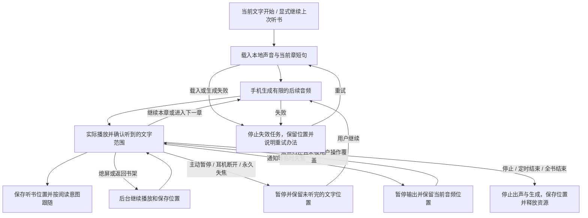
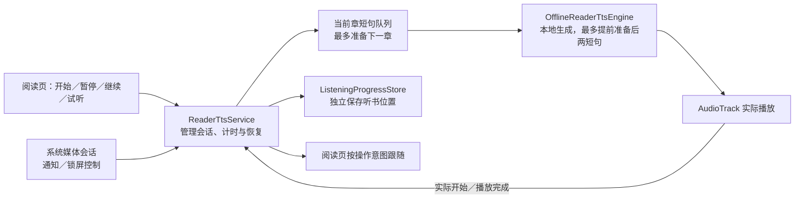

# 免费离线听书目标：实施与证据

日期：2026-09-20。状态：**按用户最终确认范围完成，v3已保留数据安装在15 Ultra并正常打开供体验。** 已确认的生成慢、章尾准备不足、消息恢复额外等待及续听位置问题已修复；独立检查无未关闭实质问题。本页保留版本与证据演进，最新能力统一见[当前状态](../../current-state.md)。主类型为听书功能完善，次类型为关联问题修复；稳定规则见[协作约定](../../knowledge/agent-operating-agreements.md)。

最终范围调整：用户明确“除开30分钟黑屏验证，其他的你确认没问题可以视为完成目标，这个不作为目标卡点”。15 Ultra四音色内部输出、正常正文、通知实际按钮、系统焦点与进程恢复均已补齐直接证据；真机不充电30分钟作为后续体验项，不阻断完成。模拟器完整长测已通过，不重复执行。原消息应用、物理耳机／来电、17 Pro及当前版本主观听感仍有未覆盖范围，明确保留，不宣称全场景验收。

## 目标与边界

交付可日常使用的中文男声听小说功能：免费，手机本地可为新的正文生成声音，核心声音不依赖系统TTS、系统音色、另外安装的语音App或云端合成；优先把运行库和所需模型一体打包。用户已明确这是个人自用App，功能与使用体验优先：复用现成方案，保留来源、版本及依赖许可的必要事实，不把未来公开分发的许可流程设成本目标卡点，不擅自修改第三方许可或项目许可。普通技术和产品取舍自行推进；仅实际影响已定目标或必须依赖用户的条件集中说明。

围绕开始、连续跨章、暂停继续、熄屏后台、常见中断恢复和阅读/听书位置衔接闭环。现有听书属于半实验版本，不能因已有服务、测试或界面就视为稳定基础。用户已报告熄屏后部分场景中断且难以继续播放：中断触发条件待定位，但可靠恢复是本轮核心要求。用户明确允许自主调整交互或彻底重构听书内部结构；优先复用经核实有效的能力，旧路径不构成实现约束，也不为重构而重构。

初始交互采用目录跳章/换书停止旧会话、手动浏览暂时停止跟随；若真实路径表明不合用，按操作意图修订并记录理由。主按钮提供开始/暂停/继续，另有明确停止入口。听书位置单独保存，不能被后台时静止的阅读视口覆盖；重新打开提供显式续听，不在应用重启后未经操作自动出声。

不扩展在线书源、账号/付费系统、声音克隆/模型训练、全书语音生成、通用模型管理平台或纯阅读重构。免费/离线是硬约束，一体打包为优先项；若需改变打包方式，先给实际体积、速度和体验结果。已有纯阅读成果、两份无关历史未跟踪计划全部保留；开始时HEAD为已推送的8c0e210，9月14日改动仍在工作区。目标完成后，用户明确授权将本轮修改提交、推送；Git交付记录见文末。

## 使用流程与完成条件

下图是本轮行为合同；实现与验证进展在文末记录，不以图代替运行证据。

必要不变量：

- 只将实际播放完成的边界视为已听完；短暂焦点中断保留音频位置接续，不重算或重复句头。服务失效、主动停止等无法保留音频帧的恢复可回到未完成短句，不能跳过尚未听完的文字。无字级对齐时按实际播放短句高亮，不按字符均分时长伪造精确进度。
- 发声文本的规范化保留原文映射；长句有硬上限，章节边界及空白不导致漏读、重复推进或死循环。
- 生成完成不等于播放完成；开始、范围、结束回调均对应真实音频播放。旧生成/旧播放器回调不能影响新会话、重读、换书或停止后的状态。
- 声音计算在后台，准备当前章和有限后续音频，不每次暂停/继续就准备全书；设置面板列音色不加载第二份大模型。
- 纯阅读不等待声音初始化；没有网络/系统TTS也能使用核心男声；失败有终态与重试入口，不损坏旧书和两类进度。
- 主动暂停不因随后音频焦点恢复而擅自出声；耳机断开暂停；临时与永久焦点丢失区别处理；停止/定时/书尾释放生成、音频、唤醒和通知相关资源。
- 服务失效后不得长期显示仍在播放，继续命令不能静默无效；原服务/引擎已不存在时，显式续听仍能凭持久听书位置重建。准备、继续、失败均有可退出的终态，应用重启不自动发声。
- 从当前文字开始使用阅读锚点；显式续听使用当前或保存的听书锚点；通知打开展示听书位置（包括暂停时）。普通打开阅读不被历史听书位置覆盖。停止/目录/换书后的操作入口说明下一次从哪里开始。

## 实施次序与最小证据

1. **独立音源与验证链路先走通。** 从真实Android入口生成新文本并实际播放。先比较至多两个有明确中文男声和Android入口的候选，筛选首句等待、持续生成速度、音质和打包成本。模型尚未证明适合时，不先完成全部外围功能。产出少量实际播放音频和可安装可行性版本，安排第一轮短真机检查。
2. **按同一流程补齐播放与位置。** 以ReaderTtsEngine工厂、ReaderTtsService、Controller和阅读锚点为现状入口，独立检查职责与状态转换；必要时替换听书结构，不以保留接口或旧交互妨碍可靠性。加入本地生成/播放、当前章队列、有限预生成、可靠取消、原文映射及独立听书进度。补主按钮暂停/继续、声音选择与试听、明确的失败/加载状态。实现高风险并发和持久化前，先通过直接回归明确预期失败。
3. **后台与完整操作接线。** 沿用Android正常媒体能力处理通知/锁屏控制、焦点、中断、耳机断开和必要唤醒边界；检查熄屏持续生成与播放，不靠常亮/连接电脑保持工作。分组验证完整ReaderScreen和真实Service，而非仅替身状态。
4. **关联验证、独立实现检查、交付。** 真机基本能力通过后集中完成整体验收。修复实际问题，只重验受影响部分。一次独立实现检查覆盖正确性和测试盲区，不递归派生审查。通过最终停止线后交付；真机证据尚缺时不以模拟器结果替代，用户明确调整范围时保留该项未验收身份。

| 未决问题 | 最小直接证据与判定 |
| --- | --- |
| 免费离线中文男声是否能独立提供 | 精确版本/资产/许可记录；禁网、无系统TTS依赖的新文本生成；实际播放录音与集中试听，不能只核对音色名称 |
| 模型是否适合手机 | 同一APK记录冷/热首句等待、合成时间/音频时长、连续播放是否耗尽缓冲、包体/内存及温度/耗电观察；模拟器仅作同环境分析，真机校准后冻结适用指标 |
| 正文和暂停是否漏读 | 长短句、数字/标点/空白、无终止符长段、章尾及短章；检查原文区间与实际播放单元，暂停发生在范围开始后仍不能跳到范围末尾 |
| 连续输入、停止和失败是否安全 | 生成期间暂停/继续/重读/换书/停止、旧计算完成、数据/模型失败；明确最终会话、是否实际出声及最后有效听书位置 |
| 后台是否真的连续播放 | 正常入口→Home/熄屏→跨章→通知暂停继续→回阅读页；输出音轨随操作变化，位置不被旧阅读视口覆盖 |
| 用户报告的数分钟熄屏后停止、定时是否可靠 | 设置30分钟定时并真实熄屏连续播放完整时段，到点停止，检查实际音频、跨段/跨章和位置；模拟器已完成，小米脱离电脑且不充电的长测按用户最终要求移为后续体验。短时后台、加速时钟或替身引擎不能冒称这项通过 |
| 中断与持久化是否正确 | 临时/永久音频焦点、用户暂停后GAIN、耳机断开、定时/书尾；真实磁盘重载及宿主进程终止后显式续听，不能以Activity重建代替 |
| 阅读能力是否退化 | 只补受接线影响的翻页/滚动/目录/设置/返回及听书跟随；9月14日测量、缓存、正文与9本导入中未受影响证据继承 |

### 设备、声音和测量边界

- 日常以任务专用模拟器开发，不默认操作用户手机。候选跑通后第一次真机只验证声音、首句等待和持续速度；功能收口后第二次集中检查完整体验。提前给用途、预计占用和最小配合；出现具体问题才追加对应检查。
- 真机验收包含脱离电脑、不充电的实际使用；无线调试仅按条件使用，连接电脑不是产品前提。用户设备为小米15 Ultra与17 Pro；15 Ultra已核对型号25019PNF3C、Android 16、HyperOS `OS3.0.306.0.WOACNXM`，17 Pro尚未核对或测试。第一次可行性检查使用15 Ultra，避免同时占用两台。
- 官方emulator console带音频录屏入口已校准并录到两种男声实际输出；ffprobe/ffmpeg可检查音轨、非静音、间隙和削波。它们不能单独判断正文内容、男声听感或自然度。工具没有已确认的直接听感分析入口；集中提供实际输出给用户试听，不上传小说音频到无关云工具。
- 不预设没有依据的p95、固定长循环或通用毫秒门槛。先记录设备、APK、排版无关的声音参数、文本、冷/热、操作及完整样本，再冻结有体验意义的指标。至少要证明持续生成跟得上播放，不因预生成一整本书掩盖吞吐问题。
- 30分钟后台保活采用单独正常启动的App，不挂instrumentation。Android 14对正在运行instrumentation的进程给额外的前台级回收保护，因此测试宿主内的长测可检查计时/链路，但不能替代这次后台生存证据。[对应Android源码](https://github.com/aosp-mirror/platform_frameworks_base/blob/android14-release/services/core/java/com/android/server/am/OomAdjuster.java#L1743-L1751)。现有模拟器录制单段最多180秒，长时音轨采用连续分段并记录接缝，不能宣称无缝录制；宿主只读检查点和媒体状态，不唤醒屏幕。

真机集中检查只要求以下操作，不要求用户掌握Android术语；没有测到的项目保留未验证身份：

| 时机 | 实际操作 | 要确认的结果 |
| --- | --- | --- |
| 候选早期，方便的一台手机约5–10分钟 | 安装候选，断网，从一本书的新文字开始；两种男声切换并各继续一段 | 真正出声、音色选择有效，冷启动等待和连续段落间停顿是否可接受；记录机型/系统/同一APK |
| 功能收口后，完整30分钟 | 选择30分钟，开始后熄屏，不连接电脑、不充电，保持实际常用的系统电池设置 | 数分钟后及后半段仍在读，到时停止，唤醒后显示定时结束并能显式继续；若中断，保留触发时间和状态再定位 |
| 同次集中检查中的短操作 | 通知暂停继续、返回正文；使用实际常用耳机时断开；一次真实系统声音中断 | 控制可用，定位到听书文字，耳机断开不外放，主动暂停不被中断恢复覆盖 |

先测默认实际条件，不以提前要求关闭所有省电、常亮或持续插线作为产品可用前提。只有实际证据指向某项系统限制，才说明必要设置、作用及剩余限制。

15 Ultra已完成文末的四音色、正常正文、通知控制、系统焦点与进程恢复检查。以下保留为用户后续实际体验的集中检查办法，不是尚待执行的目标卡点，不默认再次占用手机：

1. **短听与消息恢复。** 用户方便发声时确认当前男声、清晰度和连续正文停顿；同一播放期间，由用户通过原来会造成停顿的消息应用触发一次真实提示音。代理只核对Story App的焦点与音频恢复记录，不读取消息内容、不代发消息。判断是提示音结束后接续原句，还是仍有额外生成等待／重播。
2. **半小时脱离电脑。** 代理先通过正常面板设30分钟，记录原声音设置、起点、电量和电池温度，关闭采集器，再由用户拔线、正常开始和熄屏。沿用日常电池设置，不充电；无需用户操作ADB或持续观察界面。用户正常听书，若提前停下只记录大概时间与当时是否来电／来消息，不反复点继续掩盖现场。全程保持静音只能支持后台与进度证据，不能验收持续出声。
3. **到点后检查。** 确认到时自行停止、显示定时结束，并能显式继续和回到对应正文；重新连接后由代理核对现有播放记录与保存位置，记录电量／温度变化及适用条件，恢复检查前的定时选择。若耳机方便，一并检查断开后暂停、不突然外放；17 Pro随后只作必要兼容检查，不将15 Ultra的结果直接套用。

用户需要后续协助时再按方便时间安排，不默认允许发声或开始占用半小时。缺少相应设备或听感证据的部分保留未验收状态，不追加模拟器重复长测，也不为等待另建诊断系统。

## 委派、预算与文档

一次性验收代码预算：**预计120行，硬上限800行，默认不入仓。** 本目标起始累计0行；候选元数据解析20行，工具生成的专用AVD配置及配置操作保守计145行，长时普通入口自写正文生成7行，宿主分段录音/只读采样16行，界面XML摘要5行，分段音轨分析命令保守计5行，真机界面摘要复用入口3行，真机线程对照49行（含未生效的5行构建配置），模拟器单句ORT profiling及汇总66行，模型精度对照51行，官方FP32发布元数据提取1行，v3长测分段采集／摘要／分析42行，本地收口累计410行。后续真机增量与当前总数见文末；超过原预计但未接近硬上限。9月14日任务420行的已结束账目保留原计划，不冒称本目标已有实验。全部代理、临时源码/脚本/配置和替换稿累计计入，放`/private/tmp/story-offline-listening-20260920`，用简单行数统计，结束删除；接近上限按协作约定停止扩写。长期直接行为回归与产品构建所必需的可重复资源准备不是一次性验收框架。

一次性代码最终累计650行，未超过800行停止线，删除后不扣回。用完的源码、脚本、临时APK与手机检查程序均已清理，任务模拟器已关闭；交付时删除任务AVD、重复下载、完整日志、音轨和临时样本，仅保留两份用户数据回退备份，具体路径见文末。产品构建必需的`.local-tts`资源与交付APK保留，不把模型重复下载或一次性工具入仓。

新增验证须说明未决问题、改变哪个判断、现有入口为何不足。沿用现有Gradle/JBR/SDK及测试入口；共享构建和设备测试串行，根代理统筹。先小样本，不反复通读小说；无需运行的代码推理写清后停止。委派明确可写文件、命令、排除项、停止线和失败事实；子代理不新增验收门或审查链。

当前状态汇总用户能用什么及证据边界，本计划记录关键选择/实现入口/必要证据与限制，缺陷记录维护已确认问题。按需要补简明结构或时序图，不堆日志与每次试错。用用户操作解释结果；维护细节保留到后续能定位和修改的程度。

## 完成停止线与交付

最终停止线按用户9月20日最新要求修订：免费、本地生成和独立中文男声满足要求；覆盖的开始/连续跨章/暂停续播/后台/中断/恢复/阅读衔接有对应真实路径证据，15 Ultra实际输出、持续生成余量、通知控制和系统焦点恢复已验证；实质缺陷与独立检查问题关闭；交付APK、代码、长期回归、来源说明和精简文档。真机30分钟不充电熄屏由用户明确排除为完成卡点，其耗电／发热和脱离电脑长听结论随之保留待实测，不能写成已通过。

核心修复的现有直接证据已满足该停止线；原消息应用、物理耳机／来电、17 Pro等兼容边界不冒称实测，也不自动新增交付门槛。没有已确认未处理的核心缺陷留给用户承担。非核心视觉细调和没有可感知影响的邻接风险不扩范围。Git提交、推送已获用户后续明确授权，仅处理本轮相关修改，不混入无关历史文件。

## 当前实现与维护入口

熄屏后无需阅读界面存活；通知和锁屏按钮只是同一播放服务的操作入口。是否能持续播放，要检查下面完整路径，不能把通知仍在当作声音仍在的证据。

- 文字入口：`ReaderTtsSegmenter`保留原章偏移和发声文字映射，服务使用40字符短句上限并优先保留自然标点边界。暂停可以重读未完成短句，不跳过未听完的文字。
- 音源入口：`OfflineReaderTtsEngine`独占本地模型；`ReaderTtsAudioPreparation`最多持有后两短句，按播放顺序串行生成。取走第一句时保留第二句；当前章不足两句时，服务补入已准备的下一章开头。音色或语速改变、停止、替换目标时取消旧准备，异步发布仍须匹配会话和当前短句身份。磁盘模型准备方式见[离线声音依赖](../../knowledge/offline-voice-dependencies.md)。
- 服务入口：`ReaderTtsService`负责真实媒体会话、音频焦点、耳机断开、有限唤醒锁和有终态的准备／播放超时。倒计时使用系统单调时钟，首个实际音频开始计时，暂停冻结，继续保留剩余时间；定时/书尾结束显示对应原因。模拟器完整30分钟及小米短后台／恢复证据见下文，物理耳机和真机不充电长听保留未覆盖身份。
- 位置入口：`ListeningProgressStore`在一个原子替换文件内维护每本书听书点与最近听书籍。原阅读锚点独立；打开通知去听书文字，普通开书仍按阅读位置。

## 执行记录

### 已采用的方案与修复

- 保留9月14日全部未提交改动及两份历史未跟踪计划；初查阶段没有操作用户手机，后续真机检查取得授权后另行执行。初查发现的全书队列、范围开始误当已读完、内存听书点及缺少媒体会话等问题，已收敛到上面的有限队列、独立持久化和真实媒体服务路径；不将这些缺陷视作小米中断的唯一原因。
- 初版采用sherpa-onnx 1.13.8与Kokoro v1.1 int8，真机反馈后v3改为同款FP32模型，选择依据见下文。两种男声SID59/58经实际播放、用户试听后保留；女声SID3/4共用模型，也已取得实际播放音轨。来源、资产和eSpeak依赖许可事实统一见[离线声音依赖](../../knowledge/offline-voice-dependencies.md)；按个人自用目标推进，没有用运行库或模型的单独许可标签概括整包。
- JNI初次崩溃来自默认Kotlin lambda只有泛型`invoke`，上游需要`invoke(float[]) -> Integer`；改显式函数对象后原真实播放回归通过，未升级运行库。分句使用原章`segment(startCharOffset=...)`保留原文映射，16项无标点长段、数字、Unicode及偏移回归通过，不再手工裁剪后丢失映射。
- 暂停范围误推进与服务销毁后无法续听，均通过真实Service的RED→GREEN回归；替代引擎只稳定这些时点，不承担发声证明。独立进度存储6项磁盘回归通过；试听隔离、开始/继续选择、通知定位及设置动作已接通。宿主进程终止后的真实续听证据见下文。
- 一次独立方案检查补清服务失效重建与通知/普通开书的定位意图；一次独立实现检查的三处实质问题均关闭：自动定位跨章误停、重复媒体PLAY打断、消费后的通知在Activity重建时重放。分别有受影响路径回归，未追加递归审查。

### 性能选择与证据演进

早期定位实验使用API34 arm64模拟器、debug、每次新引擎、34字符自写句子。2线程男声59加载2428ms、生成6799ms/音频7654ms；4线程男声59加载2320ms、生成6919ms/音频7654ms；4线程男声58加载2628ms、生成6356ms/音频7694ms。这是单次样本，增加线程未显示明显收益；因此优先缩短播放单元并利用播放期间准备后续声音，不据此宣布手机性能达标。录屏有额外衰减，PCM峰值0.441而捕获音轨约-40dBFS，试听副本仅统一+36dB，不把录音响度当作手机音量。

第一轮真实阅读页→跨章→熄屏→通知暂停继续→返回→退出回归通过。相同模拟器/debug路径中，80字符上限的短章接长章静音14.39s，改40字符并保留自然标点后4.59s；暂停继续间隔15.35→9.12s包含主动暂停与旧生成取消，不是纯启动延迟。这是早期单句预准备版本的对照，不推广百分位或小米收益。

后续完整长测暴露短章尾仍会耗尽准备音频：8字符尾句播放1.794s，下一章36字符生成7.553s；只准备一句使前一段8.831s音频播放期间在尾句生成后闲置计算器，直到短尾句开播才开始生成下一章。录音出现6.024s空隙，但进程、计时和位置继续推进，原因是准备不足而非服务被杀。最终改为最多提前两短句，仍串行生成并沿用设置/会话取消身份，不增加全书生成或通用队列。对应[BUG-2026-056](../../knowledge/bugs/BUG-2026-056-short-chapter-tail-exhausts-audio-preparation.json)。

### 完整30分钟与进程恢复结果

正常入口长测使用debug APK `1d7c9f9b579b41b72afcf277a1aaaaa9845f7441b7fd1d073d3ffe723a546788`，仍为单句预准备版本。设备为API34 arm64任务模拟器（1080×2400、420dpi、60Hz、4核/2GiB，Apple M1 Pro宿主），模拟器AC供电，Wi-Fi/数据关闭，男声一、语速/音高1.0，正常系统选择器导入自写40章正文。没有instrumentation，进程实际为前台媒体服务优先级（adj 200）。播放初段PSS单次快照约482MiB，不作为峰值、真机内存或耗电结论。

- 12:36开始，首个实际音频约12:36:25；Home后12:36:31熄屏，直到定时停止后的检查始终为Asleep。中途自然进入第2、第3章，30秒只读采样持续推进。
- 实际音轨约13:06:26停止，按秒级录制起点换算约30分1秒；通知中途16m、接近结束3m与时间一致。停止后服务、媒体会话及听书唤醒锁均不存在，检查点稳定在第3章偏移1083，书籍未读完。未手动停止或加速时钟。
- 11段真实输出录音保留约定的录制接缝。阈值-65dB、最短2s静音分析除启动前、定时后外，只发现两次章尾准备间隙6.024s/6.100s；其余可录制片段未检出该长度静音。不能把分段录音称为无缝，也不能因后台/定时通过而忽略这两处等待。
- 宿主随后force-stop，确认PID6254消失；正常重开PID8342回普通阅读第1章，不自行启动服务或出声，磁盘听书点仍在第3章1083。真实面板“继续上次听书”定位第3章并发声，检查点推进到1184；实际输出录音约84秒。该恢复证据不是Activity重建，也不是替代引擎。
- 官方模拟器耳机插拔事件返回成功，但`dumpsys audio`路由始终为内置输出（`mMainType=0`），因此不形成耳机断开证据；没有改用伪造系统广播。实际耳机/蓝牙及来电、小米不充电长听仍待真机。

### v2候选的增量验证与当时边界

当时修复后debug APK为`7b13f0638cd9ef6dcfe5a67043d562793b308abf0b8fc7c65dab869c966bc764`，v2副本已核对同一指纹，251,274,093字节（约240MiB）。最新下载入口由[当前状态](../../current-state.md#两阶段推进范围)维护。v2仅重验受影响路径：

- 最多两句预准备10项回归、停止原因显示8项回归均通过，新增行为经过RED→GREEN；相关单测累计128项，不重复计算旧证据。定时结束与全书结束显示各自原因，不冒充新的30分钟界面长测。
- `ReaderOfflineListeningTest`的完整路径使用36字符正文→8字符章尾→下一章35/31字符，真实播放、熄屏、通知暂停继续及返回通过（58.772s）。最初连续播放段的章尾衔接未检出≥1s静音；后面的8.49s间隔属于主动暂停与继续准备，初始和结束静音另行排除。下一章35字符生成6608ms，在前一长句播放期间完成；这是对应机制的直接音频证据，不跨不同样本计算改善百分比。
- 真实`AudioManager`竞争焦点回归通过（58.365s）：临时打断后恢复实际音频与进度；打断中用户主动暂停后不擅自恢复；永久丢失后须明确继续。使用真实离线引擎、系统焦点和媒体控制，不直接伪造焦点回调，但不替代真实来电与厂商行为。
- 目录/下一章后选择“从当前文字开始”两项完整界面回归通过（12.415s）；换书停止、初始化中停止/暂停、分页长按原文偏移等4项相关回归也通过。这里只修正旧测试的按钮和选择器预期，产品APK未变。

本节继承的完整30分钟及宿主进程恢复仅归属前述`1d7c9f9b…`版本。v2的计时、服务生存及持久化按未改路径继承这些证据，声音准备与显示提示采用上述新包增量证据；没有将旧录音冒称v2完整长测。该次检查后任务模拟器已关闭，v3复测另记。

截至v2阶段，15 Ultra开始下面的真机检查；当时实际听感、脱离电脑且不充电的完整30分钟、实际耳机/蓝牙及来电、资源消耗仍未验收，17 Pro尚未测试。模拟器冷启动与取消后重算仍有可感知等待，不能用局部章尾改善代替真机体验判断。该阶段本地候选已交付、目标尚未完成，未新增Git提交或推送；后续v3证据与最终范围调整另记。

### 首台真机检查（v2，已结束本次占用）

用户选择USB连接小米15 Ultra，已读取确认型号25019PNF3C、Android 16、HyperOS `OS3.0.306.0.WOACNXM`；17 Pro尚未核对或测试。原版应用私有书籍、设置和进度已备份到任务临时目录，再保留数据覆盖安装v2 debug；用户正常打开原有书籍并手动开始听书。

用户现场不方便外放且没有耳机，原媒体音量为0并保持不变。官方scrcpy 4.1便携包已捕获119.876秒非零内部播放音轨，期间手机和电脑均不外放；工具只用于本次采集，不增加产品依赖或全局安装。这证明真机播放链路已有音频输出，不代替扬声器、耳机出声或用户听感。

本窗为USB充电条件，电量28%、温度34.4°C；模型加载1931ms，首声约9秒。15段约23–40字符的短句，生成5446–8954ms，对应音频4651–8468ms，部分短句生成比播放慢。持续速度余量不足是本次需要处理的实际问题，不能据此宣布手机性能通过。不充电长听、实际听感及17 Pro仍需对应证据。

随后经用户同意追加约5–10分钟，只比较线程数。临时无播放探针调用同一AAR、模型、规则、男声59和1.0倍速；两句固定中文，2→4→4→2顺序，每次模型初始化后先暖机一句再测两句，计时不含初始化和播放。对照开始电量29%、电池33.9°C；采样时进程在foreground、允许CPU 0–7、系统thermal status为0，不据此排除所有厂商调度限制。

| 线程与顺序 | 句一生成ms（音频7649ms） | 句二生成ms（音频8479ms） |
| --- | ---: | ---: |
| 2，第一轮 | 7600 | 8483 |
| 4，第二轮 | 7652 | 8581 |
| 4，第三轮 | 7665 | 8564 |
| 2，第四轮 | 7629 | 8474 |

2线程相对4线程同句均值仅快约0.6%／1.1%，不足以解决接近实时的生成耗时，生产配置未调整。此次直接定位到生成侧，但未证明模型已达硬件极限。随后在既有任务模拟器复用相同AAR的ORT profiling入口区分模型运算与外围耗时，结果见下文；不把模拟器耗时当手机改善。

102.384秒探针结束后已卸载临时测试包并删除源码/构建配置/仓库临时链接，正常打开主应用；音量仍0、无播放会话，听书进度保持章节索引1／字符504及原保存时间。手机已交还，不默认继续连接。原v2生产APK未改；本次探针不构成新版本验收。持续生成问题由[BUG-2026-057](../../knowledge/bugs/BUG-2026-057-offline-synthesis-insufficient-phone-headroom.json)跟踪。

### 真机反馈后的局部修复

用户实际听到章内／页内停顿，并确认消息提示音会中断朗读、数秒后自行恢复。两项仍属本目标的基础体验，不以“后续优化”结项。按以下因果分开处理，不更换整套播放框架：

| 问题 | 已取得依据 | 实现与最小验证 |
| --- | --- | --- |
| 连续生成余量不足 | 相同Android运行库与模型的模拟器单句profiling：完整生成7355.878ms，模型运行7349.761ms，CPU `ConvInteger` 6244.602ms（约84.9%），集中在生成波形的声码器；外围处理约6.1ms | 对照官方同款FP32模型，保留同一音色与文本资源。先同条件生成计时，再决定是否替换及说明包体代价；模型改动后复核真实播放、音色与短句衔接，不把模拟器速度作为手机验收 |
| 消息后额外等待和可能重复句头 | 临时失焦调用`engine.stop()`清空当前音频与预取；GAIN从未完成句起点重新合成。用户症状与这条代码路径相符，实际通知焦点值尚未采集 | 增加真正临时暂停／恢复，保留PCM、AudioTrack位置及有界预取；保持MEDIA+SPEECH及短暂让出焦点，GAIN接续原任务。扩展既有真实焦点用例覆盖MAY_DUCK，确认不重算同句、接续音频帧，并记录归还焦点到实际续播的时间 |

临时暂停必须同时冻结睡眠计时与播放看门狗；暂停中生成完成不能擅自出声或提交播放完成。用户主动暂停、永久失焦、停止、换书或重定位继续维持其原有优先级与失效语义。首次生成、句尾和跨章交接处发生失焦也不能漏播或重启旧任务。普通消息只需在提示音期间让出，不能把音频重算等待叠加给用户。

profiling为模拟器单次定位数据，不是手机算子占比或收益；不含播放也不能解释录音中的每处静音。官方FP32包与原int8包的voices、tokens、中英词典及三个规范化FST逐文件相同，随后按下述对照确定生产选择。独立源码调查确认不存在按音频时长sleep的生成限速；性能结论仍以直接运行结果为准。消息恢复问题由[BUG-2026-058](../../knowledge/bugs/BUG-2026-058-transient-focus-regenerates-current-audio.json)跟踪。

定向精度对照已完成：任务API34 arm64模拟器，同一AAR、CPU4线程、男声59、1.0倍速、两模型统一从应用私有磁盘读取，不开启profiling、不播放。固定句沿用现有声音用例（山林及日期时间），每模型先暖机一次，再测同句三次；结果只用于本次模型选择。

| 模型 | 加载ms | 暖机ms | 三次生成ms | 生成中位数ms | 音频时长ms |
| --- | ---: | ---: | --- | ---: | --- |
| int8 | 1569 | 6698 | 6411／6278／6413 | 6411 | 约7651–7658 |
| FP32 | 1650 | 3837 | 2953／2942／3790 | 2953 | 约7588–7590 |

本窗生成中位耗时减少53.9%，生成／播放时长比约0.84→0.39，最慢FP32样本仍明显快于最快int8样本。决定保留原引擎与四音色，切换官方FP32模型进入实际播放回归；不是另选音色，也不据此报告手机收益。模型文件增加211,332,774字节；APK与正常播放内存记录见下文，错过的探针内存窗口没有重跑。资源准备脚本已成功部署并移除受管理的旧int8打包目录，固定来源见[声音依赖](../../knowledge/offline-voice-dependencies.md)。

消息恢复新增真实MAY_DUCK回归在旧行为下明确失败：同句生成次数期望1、实际2，24.181秒结束，非夹具或编译错误。修复后15项相关单测（5焦点／10预取）和3项真实引擎／AudioTrack用例通过：通知类失焦同句只生成一次，同session从暂停帧18496接续到21760，实测归还焦点后96ms恢复；另一完整Service用例在生成过程中失焦，生成完成仍保持无声和原进度，GAIN后直接播放并完成。临时自动恢复、主动暂停优先、永久失焦需手动继续均保留。

实现检查覆盖引擎锁／旧任务失效、生成及完成回调闸门、存储和跨章交接、计时／看门狗预算，未留下实质问题。只补了生成期间被打断这一直接盲区，没有扩展新的验证体系。96ms是模拟器单个操作值，不是手机承诺。模型资源准备脚本另经独立静态检查，且实际准备成功。

新版v3 APK约441MiB（462,395,120字节），固定SHA256 `3f42ec52a8d8db43921ec3089c479cf826dcc48a8ad17cee2ab93814a3bd73a1`；相较v2约增加201MiB。增量打包曾留下约91MB无效空间，已仅重新执行packageDebug去除，未改代码或资源、未重复焦点测试。主包只含一份FP32模型；该次本地收口时手机仍安装v2，后续真机升级及验证见下一节。

### v3正常入口长听与资源结果

使用上述固定APK、同一API34 arm64模拟器（4核／2GiB、AC供电）、Wi-Fi与数据关闭、男声59、语速与音高1.0。四音色分别通过真实引擎／AudioTrack用例，并捕获非零内部输出；不以音色编号或成功回调代替输出证据。

正常系统选择器重新导入用户已有真实小说，从目录“第3章 002 全靠忽悠”章首开始，设置30分钟后Home、熄屏。没有instrumentation，普通媒体服务进程adj200；全过程PID5845不变。首声约15:26:39，15:26:45熄屏，约15:56:40实际音轨停止（录制起点按秒，约30分1秒）。途中自然跨过两次章界，结束停在新导入目录索引4／字符1749，书未读完、未手动停止；后续检查仍Asleep，服务、媒体会话及唤醒锁均已释放。

11段录音按-65dB／最短1秒检查，仅检出启动前、到时后的静音；各可录制内部片段未发现该长度间隙。录制接缝单独排除，不声称无缝记录、绝无短暂停顿或所有正文听感已验收。中途一次BUFFERING快照没有对应这一级别断音，不能只凭状态把它记为播放故障。

| 正常播放时点 | PSS约MiB | RSS约MiB | SwapPSS约MiB |
| --- | ---: | ---: | ---: |
| 第1分钟 | 664 | 692 | 23 |
| 第15分钟 | 837 | 756 | 124 |
| 第28分钟 | 874 | 685 | 227 |

PSS三次快照上升，后段RSS下降而换页增加；这是本窗2GiB模拟器下的资源事实，不是峰值、内存稳定或泄漏结论，更不能代替手机耗电与发热。冷模型加载6700ms，首37字生成4675ms／音频7740ms；录音开始早于用户播放操作，不能把录音起始静音当作准确的按钮首声等待。

本窗已有日志共264段：生成最小／中位／最大946／3156／7185ms，对应音频统计2190／6947.5／9424ms；264段均生成快于各自音频，逐段生成／音频比中位0.449，总量比0.481。这说明本窗有持续生成余量，不与不同正文的旧样本计算改善百分比，也不外推其他音色、倍速或设备。

到点后通过正常界面选择“继续上次听书”，弹窗与页面均指向新导入第5章，非零实际音轨和磁盘位置1749→1848共同确认续听，随后用可见按钮暂停。旧版本的宿主进程终止后显式恢复证据按未改存储／恢复路径继承，本次没有为了收口重跑。

截至该次本地收口，独立检查完成，v3尚未在用户手机运行，持续生成的真机缺口保留在BUG-2026-057；实际通知、冷启动、声音内容与听感、不充电长听、资源消耗及耳机行为集中待真机确认。用户已授权此时暂停目标等待接回手机；未新增Git提交或推送。

### v3真机续测

用户确认接回同一15 Ultra，型号与系统未变；USB供电，起始电量46%、电池37.9°C，媒体音量0。保留数据覆盖安装已核对SHA的v3；升级前本次ADB快照命令被沙箱阻断，未将空文件当作备份。安装后、播放前已保存当前files快照；没有清空应用数据或运行会重置书库的instrumentation。

沿用用户实际设置：男声58、1.45倍速、音高1、无定时，正常界面选择继续上次听书。模型加载3225ms；已有33段完成生成的中位耗时2801ms、对应音频中位4438ms，逐段生成／音频比中位0.643、最大0.780。这只证明这些输入的生成余量，不与不同正文、音色及倍速的旧窗计算改善百分比。播放约1分钟后的PSS单次快照约725MiB，非峰值；后续正常进度已跨章，随后通过可见暂停按钮暂停。

本次179.886秒`output`捕获全段静音，没有将其作为实际播放或无断音证据。随后保持手机音量0，改用官方`playback`入口短试听：男声58约4.546秒实际输出，与生成音频4547ms对应；男声59、女声3、女声4也分别取得约4.53／4.31／5.06秒非零输出。四项均从正常设置面板试听，未以音色编号或成功回调代替音频。先前全零属于该捕获路径的限制，不能以它判定应用未发声；内部音轨仍不代替物理出声、声音内容与主观听感。

恢复原男声58／1.45倍速／音高1／无定时后，从正常“继续上次听书”取得127.88秒录音；起始准备后约123.7秒正文连续输出，按-65dB／最短1秒的口径未检出内部静音。该窗31句生成中位2725ms、音频中位4189ms，全部生成短于对应音频，逐句时长比中位0.643、最大0.763；最后被暂停的未完成生成未计入。这是一段USB供电、前台正常听书证据，不能外推小米不充电长听。

录音工具退出后，既有系统日志显示scrcpy的AudioPolicy结束、路由回扬声器、系统发送`ACTION_AUDIO_BECOMING_NOISY`，随后应用暂停AudioTrack并放弃焦点。它符合现有耳机断开保护，不能误记为自主播放中断；也未为此新增重录或修改产品。后续无采集器的长听另取证。

shell测试通知发布成功但没有触发音频焦点变化，该通知不作为恢复通过的证据。用户随后明确将真机30分钟检查留待稍后，当前继续其他重点；独立系统焦点取证见下一节，未调整用户音量或通知设置。

本窗收口时手机留在朗读设置，媒体会话已暂停、无错误，听书位置为章节索引2／字符1215；原音色58、1.45倍速、音高1、无定时及音量0均保留。采集进程与临时代码已清理，手机临时界面文件已删，原始证据保留于任务临时目录。仅本任务的`Story App focus check`通知未清除：系统没有精确cancel命令，一次定向UI尝试未取得目标后即停止，未读取或保存其他通知。

用户补充且设备操作已确认需要区分屏幕变暗与控制栏3秒自动收起：第一次点击可能只激活屏幕，后续不能沿用已收起控件的坐标。同一设备命令中的短点按序列可以正常打开起点弹窗与朗读设置，未再将迟到点击归为权限故障。稳定经验已加入环境操作说明。

本次一次性设备时序和摘要24行、首窗生成解析5行、校准点按3行、后续界面摘要5行、正文生成摘要5行、仅提取本任务通知位置的过滤4行，合计新增46行；该窗结束时累计456行，旧410行账目不重开。仅为本窗取证，未建立新的验收入口。

### 真机短恢复与系统中断

用户明确暂缓真机30分钟，要求继续其他重点后，仍使用同一v3、15 Ultra、男声58／1.45倍速／音高1／无定时、USB供电且媒体音量0。没有更换产品代码或APK，也没有重复四音色、连续正文或模拟器长测。

- 正常界面继续／暂停，以及Home后的系统媒体控制均取得实际音轨。系统媒体命令前确认唯一活动目标是Story App；此证据不冒充物理通知按钮的点击。
- 暂停后由宿主force-stop，确认旧PID29380消失；正常重开为15510，没有自动播放或媒体会话。磁盘听书文件前后字节相同，位置仍为章节索引2／1282；阅读位置仍2／1215，仅保存时间变化。显式继续后实际生成和页面跟随从2／1285开始，听书自然推进至1321。
- 对保存点1282与生成点1285的差异，直接读取此前备份的原TXT及旧目录，按生产UTF-8、换行规范化和UTF-16偏移核对：三个字符是`U+000A U+3000 U+3000`，没有跳过正文。没有仅凭“分段器会跳空白”推断该具体输入。

普通shell通知未触发焦点，已有instrumentation会重置书库，不能直接用于用户手机。因此在用户确认安装后，用独立、无权限、无数据访问的临时Activity请求真实`AudioManager`焦点，3秒后归还。它不产生语音、不伪造应用回调；当前Story App保持正常进程与原书籍。这个最小入口回答的是小米上修复后的音频是否真正保留及恢复，不代替原消息应用或真实来电行为。

| 真机操作 | 直接结果 |
| --- | --- |
| 通知类临时焦点（MAY_DUCK） | 收到-3→1；同一句、同session2017，暂停帧36352→恢复帧38912，归还到帧推进121ms；没有重新生成被中断句 |
| 普通临时焦点（TRANSIENT） | 收到-2→1；同一句、同session2049，帧84992→88064，归还到帧推进120ms；没有重新生成被中断句 |
| 临时失焦期间主动暂停 | 焦点归还后仍PAUSED，录音持续静音，直到明确继续 |
| 其他音源取得持续焦点（GAIN） | 收到-1后暂停；对方放弃焦点不自动播放，之后显式继续取得实际非零音轨 |

同一段155.972秒内部录音与上述事件对应：前两次约3秒临时失焦均有静音与恢复；主动暂停和永久失焦后的等待区间持续静音，最后手动继续有实际声音。121／120ms是两个归还焦点至AudioTrack帧推进样本，不是分位数、通知总停顿或物理声学延迟。

本轮未发现需要再修改产品的新问题。结束时媒体会话PAUSED且无错误，声音和定时选择、媒体音量0保持不变。临时APK已卸载，源代码／构建配置／APK已删，采集与日志进程均结束。一次性代码增量：界面摘要5行、独立helper的Java／manifest／构建脚本96行、原文偏移核对6行、设备时序组合22行，新增129行；该窗结束时累计585行。原始证据留任务临时目录，文档仅保留本节摘要。

另补小米通知栏的可见按钮，避免仅用媒体命令代替“黑屏后不好操作继续”的交互证据：`mi_media_controls`卡片显示本书，“播放”切换为“暂停”并实际出声；59.89秒录音在45.616秒后有非零音频。采集器到时退出的自动暂停单独排除，重新确认PLAYING与“暂停”后，通过卡片按钮变为PAUSED；点击书名卡片可返回Story App。首点有时只激活暗屏，第二次才执行，与用户反馈一致；没有据此修改产品。收口时已暂停并收起通知栏，临时控件摘要已删。本次摘要、同命令内点击和时序组合保守计65行，全目标累计650行；不再扩展临时验证。该检查不代替尚待用户执行的30分钟不充电熄屏。

### 最终交付

用户明确真机30分钟熄屏不作为完成卡点后，按上述最终停止线完成目标。没有新增产品改动，已有对应v3的构建、回归和直接设备证据继续有效；没有因文档整理重跑测试。已确认的实质缺陷均关闭，BUG-2026-057按已测FP32吞吐与连续实际输出收口，冷加载数秒、约441MiB包体及设备证据边界保留。

本地交付包与15 Ultra已安装`base.apk`的SHA256均为`3f42ec52a8d8db43921ec3089c479cf826dcc48a8ad17cee2ab93814a3bd73a1`，因此未重复安装相同版本。通过正常MAIN／LAUNCHER入口打开成功，前台为MainActivity，媒体会话PAUSED且无错误。书籍、进度和用户声音设置保留，媒体音量仍为0；用户可以拔线，在方便时调高媒体音量体验。APK入口由当前状态页维护。手机交付时尚未提交，随后用户授权进行Git交付，记录如下。

临时检查程序已卸载，采集／日志进程结束，任务模拟器关闭；任务临时目录中的源码、APK、AVD、下载副本、完整日志、音轨及自写样本均已删除。仅为试用期保护用户数据，保留`/private/tmp/story-offline-listening-20260920/phone-15ultra/pre-upgrade-files.tar`（v2升级前）及`/private/tmp/story-offline-listening-20260920/phone-15ultra-v3/post-upgrade-before-playback.tar`（v3安装后、播放前）两份回退备份，不入仓、不称长期备份。`.local-tts`正式构建输入、交付APK和已有用户文件保留。

### Git交付

目标完成后用户明确授权提交并推送。核对远端仍为原基线后，在原分支`feat-android-reader-foundation`形成两笔一致代码提交：`a1a2538`复用分页测量，`d8848fe`包含阅读交接、离线听书、长期回归和固定资源准备入口；均已正常推送至origin。阅读与听书共用的设置／定位接线保留同一提交，未人为构造缺少依赖的中间版本。文档随后单独提交；未改产品内容或重复运行已有效的设备验证。

二进制模型、APK、临时文件和两份原有历史未跟踪计划未提交；模型通过固定版本及SHA校验脚本准备。暂存差异检查通过，未新增合并或强制推送。
