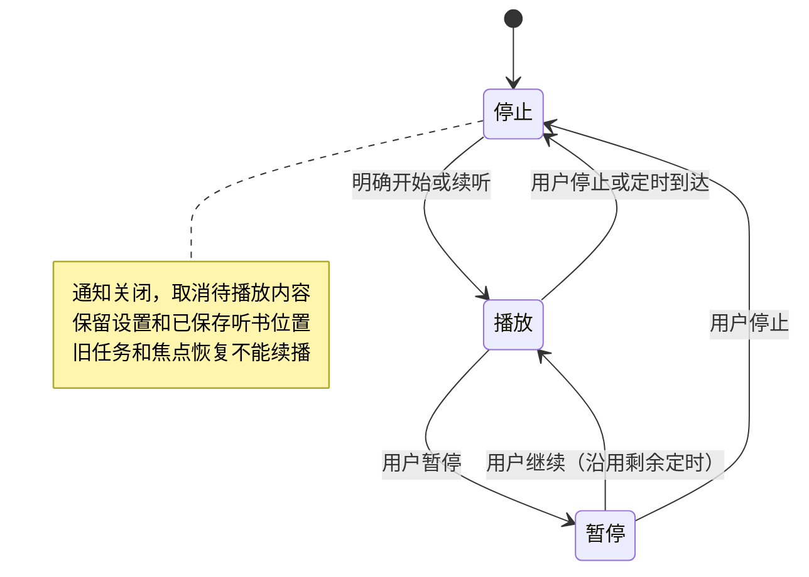

# 大脸猫阅读：视觉改版与听书操作优化

状态：已完成，2026-09-20。基线 `15629bf`；继承已交付 v3 的阅读及免费离线听书证据。用户已认可[视觉讨论稿](../specs/2026-09-20-visual-direction.md)，本计划承接四页方向及新增语速、停止、名称图标要求。原有两份未跟踪历史计划不属于本轮修改范围；本轮代码尚未提交或推送。

## 目标与边界

主类型：产品交互优化；次类型：直接相关问题修复。结论：书架、阅读控制、设置和听书形成统一且可操作的视觉；2×实际可连续听书，暂停与停止易找且含义明确；以“大脸猫阅读”和原宠物猫脸图标覆盖升级，旧数据保留。

必要不变量：正文区尺寸不随控制面板展开改变；不隐式改变字号/主题/定位或重置偏好；保留原安装身份、签名、存储格式、免费离线音源；停止后旧生成/音频焦点回调不得重新播放；保留已保存听书位置。图中字号、假书数量和纹理不作为实现规格。排除搜索、删书、在线封面、书源、时间轴、播放框架整体重写和依赖升级。

## 产品与实现决定

- 暖纸、墨字、松绿为默认 UI 主题，夜间用同一信息层级。原阅读主题选择继续生效；操作强调色独立于正文排版参数。系统中文字体、矢量图标、至少48dp触控区；颜色选中同时有文字或勾选。
- 书架书名优先、本地文字封面、次级元信息、清晰导入入口；收起未开放在线书源占位。保留仓库与导入路径。
- 控制栏减轻容器和阴影，图标加中文标签；设置采用单层视觉、对齐参数行，保留既有阅读/听书页签和系统返回职责。面板覆盖正文，不参与分页高度计算。
- 听书主操作按状态显示开始/暂停/继续，并列直接停止。阅读页、面板、通知/锁屏共用现有语义。音色、语速、定时前置，音高次级展开；不能为布局删掉已有定时选项或试听。
- 语速列表为0.85、1、1.3、1.45、2，标签准确。旧1.15设置迁至1×，避免用户无意加速；其他实际值不变。使用真实引擎核对1×/2×同文音频、多段和跨章，以及播放中换速的预生成音频失效。
- 暂停保留会话与剩余定时；停止取消生成/队列、清本次计时、释放播放资源、收起通知，保留设置和已保存位置。再次开始为明确用户操作，重新使用所选定时时长。沿用已确认位置，不承诺精确保存到停止瞬间的字。
- 先定位并记录当前宠物素材，再取原猫脸制作图标；检查圆形/圆角方形及小尺寸。名称覆盖应用标签、通知渠道/文案等对用户可见入口，内部包名和签名不变。

## 执行顺序及最小证据

1. 核对代码、素材、构建和设备；独立核对本方案的实际接线风险。沿用JBR/Gradle Wrapper/SDK；无关沙箱问题以对应权限处理，不更换依赖来源。
2. 先为语速迁移/准确标签、暂停与停止、换速取消的行为补已有入口回归，观察有效失败再修改。纯颜色/图标/文案不机械新增测试。
3. 分组实现主题与书架、控件/面板、听书接线；保持各代理文件所有权明确。根代理负责构建、完整界面、音频和合并集成。
4. 在同一可用模拟器以旧APK正常导入自写样本、设置非默认偏好及听书点，再覆盖新APK，验证旧数据与身份。使用代表手机尺寸、较窄窗口和大字体；日/夜均查看四页，不穷举矩阵。
5. 完整ReaderScreen正常操作：连续翻页后开关面板、切设置和模式、立即返回重开；开始→暂停→继续→停止→再开始，准备中停止、停止后等待旧任务、后台通知操作及受影响恢复。动态操作/录屏证明交互，截图仅证明静态视觉。无相关变更不重复第一阶段全套或30分钟长测。
6. 真实离线引擎输出同文1×/2×音频，记录时长和实际输出；观察连续多段、跨章及切速，发现明显停顿/漏读/旧速混入须修复。不能用引擎替身、选项显示或严格二分之一时长代替声音证据。先小样本校准捕获，再扩大有必要的输入。
7. 一次独立实现检查覆盖正确性和测试盲区；只补新问题。最终产出覆盖安装APK、四页前后真实截图对比、最小验证摘要及限制，收口当前状态。

| 结论 | 权威证据 |
| --- | --- |
| 旧设置不意外加速、语速标签准确 | 现有设置存储单测及界面实际选项；旧1.15读为1 |
| 暂停与停止不同且一致 | 控制器/服务相关回归 + 完整界面/媒体操作，停止后无生成输出、通知/服务结束、再开始保留进度 |
| 改版不扰动阅读 | 完整界面连续操作前后确认锚点、开关面板排版身份不变，退出/恢复与对应录像 |
| 2×真正可用 | 正常路径真实引擎的1×/2×同文音轨、多段/跨章输出及必要生成耗时；明确模拟器性能边界 |
| 身份/旧数据保持 | APK包名与签名 + 旧版到新版覆盖安装后书籍、偏好、阅读/听书位置 |
| 视觉与图标落实 | 最终APK四页日/夜截图、窄屏/大字实际布局、桌面图标及源猫脸对照 |

## 执行约束与停止线

通用规则仅维护于[协作约定](../../knowledge/agent-operating-agreements.md)。本轮明示：一次性验收代码预算**预计160行，硬上限800行，默认不进入仓库**；新目标起始0行，主代理及子代理的临时脚本/配置统一计入，放`/private/tmp/story-visual-upgrade-20260920`并在结束删除。长期直接行为回归不计入，不能给一次性框架改名。800是停止线，超额须明确授权，预算使用简单行数统计。

新增验证必须回答具体未决问题、说明何种结果改变实现/通过判断及已有入口为何不足。逻辑可直接推出的事实不另写验证器；不递归审查或验收验收器。继承未失效证据，只重验受影响范围；共享构建输出和设备测试串行，结果对应新构建，文档或交付不触发重跑。

委派明确可写文件、允许命令、排除项、停止条件；子代理不得自行扩展验证门或派生审查链。根代理授权新增验证、统筹构建和设备。目标默认以模拟器及实际音频完成；小米专有表现如实列未测，不单因缺真机阻断。只有明确的新增设备阻塞才集中提出最小真机需求。

停止线：目标各项有对应直接证据，明确关联退化已处理，独立检查实质问题关闭，APK及对比交付完成即停止；不扩展无感细调。维护最小设计决定、图/代码入口、证据与限制，不存原小说、完整日志和临时报告。Git提交/推送不默认扩展到新目标，按用户已有明确授权适用范围处理。

## 执行记录

- 起始：工作区仅上一轮视觉讨论稿、素材和当前状态修改，以及两份无关历史未跟踪计划；产品基线未变。原Pixel_8 AVD此前空间不足，不删除其数据；本轮选择独立模拟器，并通过对应本地权限解决ADB沙箱监听限制。
- 环境已恢复：临时Story_Visual，API34/1080×2400/420dpi、3GiB、4核、SwiftShader，原AVD数据未改。共享Gradle和设备操作串行。
- 独立方案检查采纳两点：换速清缓存后立即重补后两句（当前已取出短句保持原速，下一句新速）；听书面板主动作接真实暂停/继续，不把“从当前文字开始”换标签伪装为暂停。
- 语速3类23项单测先有2项有效失败（标签、旧1.15），实现后全部通过；准备器的速率key及取消保护有效。5项新设备回归先全部按预期失败；集成后控制栏8项、听书面板13项、后台11项、设置展开2项合计34项通过。
- 真实同文34字、kokoro:59：1×生成3555ms/音频7588ms，2×生成2027ms/音频4411ms，均完成AudioTrack实际输出及模拟器音轨采集。此处证明同文新速率已生效，连续多段/跨章另见下文完整路径。预览WAV仅增加20dB便于听取，不作为设备外放音量证据。
- 独立实现检查发现返回按钮48dp但起点14dp侵入52dp正文起点；触摸回归实际得到正文首行点击触发返回，修正为起点4dp，保留48dp点击区且不改变正文，对应GREEN。修复补入[BUG-2026-040](../../knowledge/bugs/BUG-2026-040-page-mode-immersive-header-overlaps-body.json)。
- 通知补充：Android13+实际系统媒体操作由PlaybackState构造，旧Notification.addAction“停止”并不保证系统卡可见。按[官方规则](https://developer.android.com/about/versions/13/behavior-changes-13#media-controls)补显式媒体自定义停止动作，沿用已有停止路径；新回归先因缺少该动作失败，修正后验证服务、通知、计时结束及迟到回调不复播。实际媒体UI的停止操作亦已检查，见下文。
- 最终接线的18项定向设备回归通过：13项听书面板（包括首次起读不再重复按钮）、媒体自定义停止、正文续页点击展开、关闭设置自动收起、连续前前后翻页和设置保存重开。面板13项属于重验，不能与此前34项简单累加。语速单测、其他控制/后台及第一阶段无关路径继承有效证据。
- 实际听书测试暴露UiAutomator在面板滚动、播放状态更新后保留过期文字节点；正常手指路径可选定时，读取刷新节点也能看到原查询漏掉的“继续朗读”。选项补按钮可访问名称，完整界面回归重取当前节点并处理标准StaleObjectException，仍通过实际点击、磁盘设置和真实播放断言，不直接注入通过状态。
- 音频环境校准：原3GiB/SwiftShader模拟器的一次31字合成耗时22.4秒，产生16.7秒内部空档；另次同段3.6秒但其他段仍波动，同时观测到kcompactd和软件图形系统负载。重启同一临时AVD为4GiB/host GPU、飞行模式后，同一跨章序列36/8/35/31字分别生成3300/683/2738/3210ms，均在对应提前量内。19.334–30.261秒的实际连续音轨未检出≥0.8秒静音，随后5.37秒为主动暂停及显式继续准备；这仅证明该环境该序列，不宣称所有设备2×无停顿，也不把调整测试环境写成产品性能优化。
- 覆盖升级：旧v3通过系统文件选择器导入自写《山间来信》，真实操作设字号22、旧1.1×（磁盘1.15）和30分钟，阅读及听书推进到第三章后暂停。覆盖安装本候选并正常启动后，书籍、字号22、30分钟及阅读位置保持，听书位置仍为该章字符35；源TXT和目录SHA一致，设置和听书文件字节一致。UI以1×选中恢复旧1.15，初始化没有重写设置；阅读位置的章号／字符／模式不变，正常保存仅更新时间。这里保留“第三章”与内部chapterIndex=3的区别：合成前言占内部索引0。
- 最终真实2×完整界面回归通过（52.219秒）：面板选择2×和30分钟→多段跨章→暂停1.2秒，计时与位置不变→继续实际出声→直接停止，服务／通知／输出／计时结束且等待3秒无复播→继续上次听书，从已保存章字位置实际播放并推进，重新采用30分钟。由真实离线引擎运行，测试只建立确定性书籍输入，操作经过实际面板。连续段生成3317/910/2818/2510/2969ms，均赶上待播时间；内部音轨20.113–31.443秒连续窗口未检出≥0.8秒静音，之后4.515秒为主动暂停及显式继续准备，停止后按用户要求重新加载出声，不把这些主动中断计作章内卡顿。既有准备器回归同时覆盖换速后旧音频失效，当前已播放短句仍按原速结束。
- 最终视觉与系统操作：四页日／夜共8张实拍；320dp宽、字体1.3倍时字号、语速、定时、导入可达，横屏参数可滚动操作。实际通知暂停态和锁屏准备态的停止均可见且结束会话；未把锁屏准备态描述为稳定播放的长听检查。桌面圆形图标实拍清晰，其他遮罩依靠自适应图标安全留白，未逐个测试厂商桌面。日间书架另发现状态栏浅色图标不可读，已局部修正主题接管，日／夜及返回阅读页检查通过，见BUG-2026-059。
- 升级路径包含旧进程force-stop和新版正常冷启动，不以Activity重建替代。未受影响的旧长听／音频焦点证据继续按原版本与条件继承，没有追加全量测试或30分钟循环。

## 最终实现入口与交付身份

- `ui/theme`和`BookshelfScreen`维护界面角色、文字层级及本地文字封面；`ReaderControls`、`ReaderActionIcon`和两个设置面板维护覆盖式控件。正文配色仍由`ReaderThemePalette`和用户主题决定，分页逻辑、排版高度及磁盘格式不变。
- `ReaderTtsSpeechRates`维护档位和准确标签；`ReaderSettingsStore`只读兼容旧1.15。`ReaderScreen`连接实际开始／暂停／继续／停止；`ReaderTtsService.applyRuntimeSettings`负责换速后补充待播音频，媒体停止复用同一结束路径。
- 图标源和处理方式见[原宠物素材记录](../specs/assets/2026-09-20-visual-direction/icon-source.md)。图标为原猫脸的透明适配图，使用Android自适应图标，未更换包名。
- 最终[debug APK](/Users/longshengxi/proj/story_app/app/build/outputs/visual-upgrade/daliamao-reader-debug-20260920.apk)：464,782,199字节（约443MiB），SHA256 `901173a79692044a09dfa414ff8d5a91c98cc70fd604c272428084a759aa4aeb`；包名`com.longerlsx.storyapp`，versionCode仍为1、versionName仍为0.1.0。签名检查通过，与旧v3相同的签名SHA256：`cba64d3b44548055d79ff4e677e64d7f464cdf59fbaf538cf41a377dfc1912eb`。
- [真实四页前后对比](../specs/assets/2026-09-20-visual-direction/implemented-compare.html)包含最终实现的日夜实拍；概念图仍保留历史身份，不冒充App实现截图。音频预览：[同文1×](/Users/longshengxi/proj/story_app/app/build/outputs/visual-upgrade/audio/same-text-1x.wav)、[同文2×](/Users/longshengxi/proj/story_app/app/build/outputs/visual-upgrade/audio/same-text-2x.wav)、[连续跨章2×片段](/Users/longshengxi/proj/story_app/app/build/outputs/visual-upgrade/audio/continuous-2x-cross-chapter.wav)。

## 完成范围与保留限制

本轮目标范围内的改版、2×、暂停／停止、名称图标、覆盖升级及直接关联退化已完成；独立实现检查的实质问题已处理。目标验收时未使用小米；随后按用户要求在15 Ultra覆盖安装并正常打开，手机base.apk的SHA256与本页最终交付包完全一致，未清除应用数据。安装本身不证明15 Ultra／17 Pro的2×性能或厂商媒体卡验收；没有重复30分钟真机熄屏。内部音轨不等于物理外放或耳机听感，没有对任意正文逐字发音作全面保证。

主动暂停后继续、停止后重开仍可能需要短句重新生成／模型加载；本轮没有将这类明确中断后的等待改为无缝播放。2×持续生成余量依赖设备与资源环境，资源不足模拟器出现的空档已如实保留，正常校准环境该跨章路径通过，不声称所有输入绝无停顿。

一次性代码及配置保守约220行（包含自动生成AVD配置144行），低于800行停止线；最终清理本轮临时AVD、脚本、原文、日志和完整录像，只保留交付APK、精简音频和必要界面图。原Pixel_8 AVD及两份无关历史计划不动。工作在现有检出目录，未另建工作树；Git提交／推送等待本轮授权，不沿用旧目标授权。
