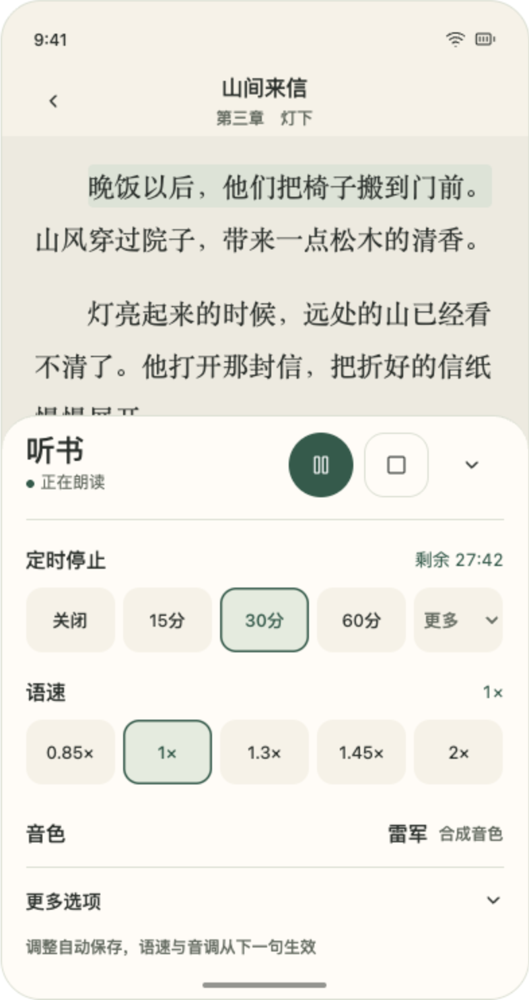
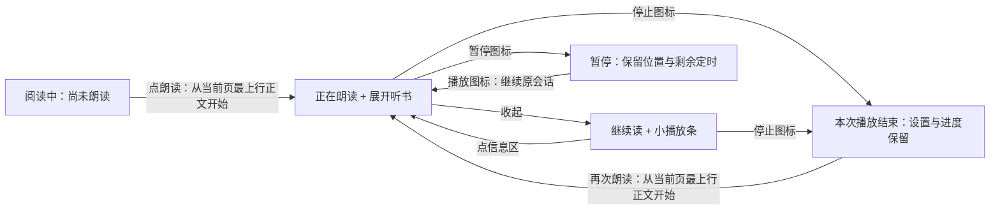

# 听书交互与单一音色讨论稿

日期：2026-09-22。状态：**用户已认可修订后的交互方向，现由[实施计划](../plans/2026-09-22-zipvoice-listening-upgrade.md)承接；本稿保留设计依据。** 基于当前工作区的9月20日视觉版本，以及9月21日真实小说同文试听。用户随后开启实施目标，最新验收范围为仅模拟器，不安排或等待真机；下文原讨论中的真机要求不作为本轮门槛。

同日修订：按用户反馈去掉“已停止／已保存”等额外成功提示；每次新开朗读固定从当前页面最上一行正文开始，删除全部起点选择。暂停继续仍属于原会话，不重新从页顶读。

## 音色选择与“训练”的区别

用户认可昨天的 ZipVoice-Distill `leijun-1` 参考声音，希望下一版替换现有全部音色，先只保留这一种；以后再按需增加。原先“当前 Kokoro 保底”是调查阶段策略，不能据此把多引擎、多音色继续作为最终产品要求。讨论时产品仍使用Kokoro；本稿以下“当前接线”指该设计基线，后续实现状态由[当前状态](../../current-state.md)维护。

昨天的样音没有训练新模型：预训练的 ZipVoice 接收参考录音及逐字对应的文字，再生成小说内容。以后增加音色通常沿用这个方法，主要工作是选择清晰、无配乐、说话风格合适的单人录音，整理对应文字，并用真实正文检查效果；不是每次重新训练。参考声音的口音、节奏和录音质量会影响效果，不能保证任意录音都合适。真正训练／微调需要另外准备数据和训练评估，不宜描述成简单换文件。

资料依据：[ZipVoice 官方用法](https://github.com/k2-fsa/ZipVoice#usage)；实际样音配置见[此前试听记录](2026-09-21-chinese-tts-quality-research.md#真实小说同文试听)。下一版仍须确认目标小米上的首声、持续生成及已有2×需求；用户认可的是听感，电脑样音不代表手机已达标。本轮不新增模型评测。

## 推荐界面

沿用暖纸与松绿外观，把听书从“阅读与听书”设置页签中独立出来。阅读设置只保留阅读相关内容。下面是**设计示意，不是 App 运行截图**；示例正文为自写短文。

| 展开听书面板 | 收起后的播放条 |
| --- | --- |
|  |  |

可点按的原稿随本次对话保存在 [听书交互原稿](/Users/longshengxi/.codex/visualizations/2026/09/11/01a08f33-d662-7072-896b-da1d43153064/listening-controls.html)；不播放声音、不修改真实设置。仓库中的两张图用于后续维护时查看布局。

- **顶部：**“听书”及简短状态，右侧依次为播放／暂停、停止、收起图标。没有“当前状态：”段落和重复的大文字按钮。图标有可访问名称，触控区至少48dp；暂停与停止分开，停止不采用删除式红色警告或确认弹窗。
- **安静反馈：**正常播放操作与设置调整只更新原位图标、状态及选中项，不追加“已停止；设置与听书位置保留”“已保存”等提示，也不改变面板高度或自动收折“更多”。只有需要用户处理的失败才显示错误；不把错误反馈一并删掉。
- **定时第一：**剩余时间清楚可见，关闭／15／30／60分钟一排，90／120分钟进入“更多”菜单。菜单选择即生效，不另点确认。不增加本章结束、全书时长等新能力。
- **语速第二：**0.85×／1×／1.3×／1.45×／2×一排，沿用现有真实档位。
- **音色第三：**一行“雷军 · 合成音色”。当前只有一个，不显示假下拉、试听按钮或空的音色列表；以后增加音色，再将同一行变为选择入口。
- **其他折叠：**仅保留音调，不保留章首／当前页／历史听书点等起点选项。不新增跟读开关、特效或全书音频时间轴。音调是否沿用当前PCM播放侧处理，须在换引擎时核对，不能仅由设计图声称通过。
- **收起：**底部小播放条保留状态、定时、语速和暂停／停止。点左侧信息区展开面板；收起、点正文或系统返回关闭面板均不暂停。阅读中调出原目录／阅读设置的入口继续保留：正文短按显示普通控制栏，播放条可位于其上方；普通控制栏中的“听书”只展开面板，不重复启动。

默认字体与正常竖屏以一个面板容纳全部常用项。窄屏、大字体或横屏必要时允许面板内部滚动，顶部播放／停止固定可达，不通过缩小点击区硬塞。面板覆盖正文，不改变排版尺寸、分页或确认进度；播放条也不能永久盖住正在读的文字，沿用可见位置处理。图中的高亮仅示意当前朗读位置，不代表新增逐字跟随能力。

## 操作语义

| 操作／状态 | 建议结果 |
| --- | --- |
| 没有活动会话，点右下角“朗读” | 直接从当前页面最上一行正文的行首开始，展开听书面板；没有起点选择。历史听书点不覆盖这次明确意图 |
| 已有播放／暂停会话，打开听书面板 | 只打开面板，不重新开始；播放与暂停由独立图标控制 |
| 点暂停 | 保留会话、听书位置和剩余定时，图标变为播放；允许从尚未完成的短句恢复，不承诺精确到音节 |
| 点播放 | 暂停态继续当前会话；停止态从当前页面最上一行正文开始。不提供额外起点入口 |
| 点停止 | 立即停止输出、取消排队合成、结束定时并移除播放通知；设置和已确认听书位置保留。面板若已打开则原位更新为停止状态，不弹成功提示、不自动收折其他选项；小播放条若独立显示则收起 |
| 再次开读 | 使用已保存设置，重新按选定时长计时。停止不等于清除定时预设 |
| 改定时 | 换时长即重设本次倒计时；暂停态保留完整新时长，到继续时才计时。再次点已选时长不重置；无需另加重置按钮 |
| 改语速／音调／未来音色 | 选择即保存，无应用按钮；当前句继续，下一语音单元使用新设置，过期预生成结果不得继续排队。新引擎需保证这个等待边界足够短且有状态反馈 |
| 准备声音／失败 | 明确显示准备中或失败，停止和返回可用。失败不伪装为播放中，不自动越过正文；原处提供重试，不要求深入设置找恢复操作 |

“当前页面最上一行正文”使用打开面板前的页面快照：分页模式取当前页首个正文行，滚动模式取阅读区最上方可见正文行，均从该行首字开始；不是章首、段首或屏内历史锚点，也不是顶栏、页码等控件文字。停止后重开、退出再进入后新开均遵循此规则；暂停继续保留原会话位置与剩余定时。

长按右下角“朗读”可只打开设置，供少数想先调整参数的情况使用，不再承担选择起点的职责；长按松手不得再触发开读。系统首次通知授权等必要平台弹窗按已有机制处理；“一点开读”指不再添加产品起点确认，不承诺绕过系统权限流程。

定时沿用当前“会话倒计时”：首次真实发声后才开始，后续句间等待继续扣时，用户或音频焦点暂停冻结剩余。不描述为逐秒累计实际发声音频，也不把打开面板当作重新计时。

## 现有接线与实施时需核对的边界

- `ReaderScreen.chooseListeningStart` 当前有历史位置时先问起点；本稿要求删除起点选择，直接获取当前页最上一行正文的行首锚点，不能简单复用可能落在屏幕中间的旧锚点。保留既有进度存储，不把历史听书点作为新开朗读的起点。`ReaderControls` 承接紧凑播放条与图标动作，`ReaderTtsSettingsSheet` 调整优先级；不复制第二套播放状态。
- 当前 `ReaderTtsService` 已负责暂停／停止差异、计时、通知和设置更新，`OfflineReaderTtsEngine` 负责播放音调；视觉拆分沿用这些语义。引擎替换是另一个需要性能和声音证据的实施部分，不能以图代替。
- 重点覆盖：分页／滚动的页顶正文开读、暂停后改设置／继续、停止后重开、收起仍播、计时不因面板反复开关重置、手动导航后的起点与旧任务覆盖、图标与通知状态一致。正常操作不增加成功提示或撑动面板；长按打开面板不触发朗读，面板操作不穿透为翻页。
- 本轮仅核对代码语义，并在本地浏览器检查设计稿的展开／收起、暂停／停止／重开、2×、定时及320px窄屏展开；不运行 Android 构建或设备验收，不宣称新界面或 ZipVoice 已在手机可用。

本次修订检查：设计稿中切换语速／定时／停止时面板高度不变，展开“更多”后停止也不自动收折；额外成功提示及起点操作均已删除。只证明设计稿交互，不代替 Android 实现验收。
